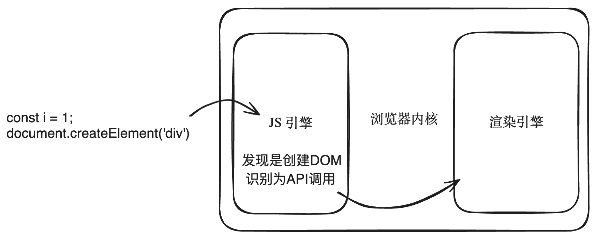

# 虚拟 DOM

## DOM 的工作原理

我们写的代码是 JS 写的，但是浏览器的引擎是 C++ 写的

```js
const div = document.createElement('div');
```

浏览器引擎是如何处理这段 JS 代码的？

这里介绍一个东西：Web Interface Definition Language，简称 WebIDL，中文称为：Web 接口定义语言。它就是用来定义接口的！

定义浏览器和 JS 如何进行通信的接口。换句话说，浏览器（C++）提供的一些功能（本地功能）如何能够被 JS 调用。

通过 WebIDL，「浏览器开发者」可以描述哪些类和方法能够被 JS 访问，以及这些方法应该如何映射到 JS 中的对象和方法。

假设现在有如下的 WebIDL 定义，用于创建 DOM 元素：

```web-idl
interface Document {
  Element createElement(DOMString localName);
};
```

这里定义了一个 Document 的接口，该接口内部具有一个 createElement() 方法用来创建 DOM 元素。

接下来「浏览器开发者」需要使用 C++ 来实现这个接口：

```c++
class Document {
  public:
    // 实现了上面的接口，定义了具体如何来创建 DOM 元素
    Element* createElement(const std::string& tagName) {
      return new Element(tagName);
    }
};
```

接下来的步骤非常的重要，需要生成绑定代码（绑定层），绑定了 JS 如何调用这一段 C++ 方法：

```c++
// 这个绑定代码是由 WebIDL 编译器自动生成
// 这就是 JS 到 C++ 的绑定
// 换句话说，这段绑定代码决定了 JS 开发者可以调用哪些方法从而来调用上面的 C++ 方法
void Document_createElement(const v8::FunctionCallbackInfo<v8::Value>& args) {
    v8::Isolate* isolate = args.GetIsolate();
    v8::HandleScope handle_scope(isolate);
    Document* document = Unwrap<Document>(args.Holder());

    v8::String::Utf8Value utf8_value(isolate, args[0]);
    std::string localName(*utf8_value);

    Element* element = document->createElement(localName);
    v8::Local<v8::Value> result = WrapElement(isolate, element);
    args.GetReturnValue().Set(result);
}
```

有了绑定代码之后，需要在 JS 引擎里面进行注册：

```c++
// 将上面的绑定代码注册到 JS 引擎里面
void RegisterDocument(v8::Local<v8::Object> global, v8::Isolate* isolate) {
    v8::Local<v8::FunctionTemplate> tmpl = v8::FunctionTemplate::New(isolate);
    tmpl->InstanceTemplate()->Set(isolate, "createElement", Document_createElement);
    global->Set(v8::String::NewFromUtf8(isolate, "Document"), tmpl->GetFunction());
}
```

最后「Web 开发者」在进行开发的时候可以在 JS 文件中书写如下的代码：

```js
const i = 1;
document.createElement('div');
```

首先 JS 引擎来执行 JS 代码，`const i = 1` 是 JS 引擎完全可以搞定的，`document.createElement("div")` JS 引擎发现你要创建 DOM 元素，会将其识别为一个 API 调用，然后向浏览器底层（渲染引擎）发出请求，由浏览器底层（渲染引擎）负责来创建 DOM 元素。

浏览器底层创建完 DOM 元素之后还需要给最初的调用端返回一个结果，所谓最初的调用端也就是 JS 代码中调用 DOM API 的地方。

如下图所示：



所谓我们所指的真实 DOM 指的就是：浏览器底层已经调用过 C++ 对应的 API 了。

假设你在 JS 层面：

```js
document.appendChild('div');
```

那么浏览器底层在调用对应的 C++ 代码的时候，还会涉及到浏览器重新渲染的相关内容，这又是一个很大的话题。

## 虚拟 DOM 本质

虚拟 DOM 最初是由于 React 团队提出的：

> 虚拟 DOM 是一种编程概念。在这个概念里， UI 以一种理想化的，或者说“虚拟的”表现形式被保存于内存中。

理论上来讲，无论使用什么样的方式，只要将文档的结构展示出来，你的这种方式就是一种虚拟 DOM。

虽然理论是美好的，但实际上也就只有 JS 对象适合干这个事情。

在 Vue 中可以通过 h 函数得到一个虚拟 DOM：

> 创建虚拟 DOM 节点 (vnode)。

```js
import { h } from 'vue';

// 除了 type 外，其他参数都是可选的
h('div');
h('div', { id: 'foo' }, 'hello');
```

完整的例子：

```js
import { createApp, h } from 'vue';

// 子组件
const Child = {
  template: `
  <div class="child-container">
    <h3>这是子组件</h3>
    <p>姓名：{{ name }}</p>
    <p>email：{{ email }}</p>
  </div>`,
  props: {
    name: String,
    email: String
  }
};

// 根组件
createApp({
  template: `
  <div class="app-container">
    <h1>这是App组件</h1>
    <Component :is="vNode" />
  </div>`,
  setup() {
    // 创建一个虚拟 DOM
    const vNode = h(Child, { name: '李四', email: '123@qq.com' });
    console.log(vNode);

    return {
      vNode
    };
  }
}).mount('#app');
```

通过案例，可以得出结论：虚拟 DOM 本质就是一个普通的 JS 对象（至于属性的作用先不用关心）。

## 为什么要需要虚拟 DOM

最早期的时候，前端是手动的操作 DOM 节点来编写代码。

创建节点：

```js
// 创建一个新的<div>元素
var newDiv = document.createElement('div');
// 给这个新的<div>添加一些文本内容
var newContent = document.createTextNode('Hello, World!');
// 把文本内容添加到<div>中
newDiv.appendChild(newContent);
// 最后，把这个新的<div>添加到body中
document.body.appendChild(newDiv);
```

更新节点：

```js
// 假设我们有一个已存在的元素ID为'myElement'
var existingElement = document.getElementById('myElement');
// 更新文本内容
existingElement.textContent = 'Updated content here!';
// 更新属性，例如改变样式
existingElement.style.color = 'red';
```

删除节点：

```js
// 假设我们要删除ID为'myElement'的元素
var elementToRemove = document.getElementById('myElement');
// 获取父节点
var parent = elementToRemove.parentNode;
// 从父节点中移除这个元素
parent.removeChild(elementToRemove);
```

插入节点：

```js
// 创建新节点
var newNode = document.createElement('div');
newNode.textContent = '这是新的文本内容';
// 假设我们想把这个新节点插入到id为'myElement'的元素前面
var referenceNode = document.getElementById('myElement');
referenceNode.parentNode.insertBefore(newNode, referenceNode);
```

上面的代码，如果从编程范式的角度来说，是属于「命令式编程」。这种命令式编程的性能一定是最高的！

无论玩的多花，最终都要落实到 DOM 操作上。

这意味着假如你要创建一个 div 的 DOM 节点，没有什么比 `document.createElement("div")` 这句代码的性能还要高。

虽然上面的模式性能最高，但是实际的开发中，开发者往往更加倾向于更加方便的方式。

例如下面的示例：

```js
<div id="app">
  <!-- 需求：往这个节点内部添加一些其他的节点 -->
</div>
```

如果使用传统的命令式编程：

```js
// 获取app节点
var app = document.getElementById('app');

// 创建外层div
var messageDiv = document.createElement('div');
messageDiv.className = 'message';

// 创建info子div
var infoDiv = document.createElement('div');
infoDiv.className = 'info';

// 创建span元素并添加到infoDiv
var nameSpan = document.createElement('span');
nameSpan.textContent = '张三';
infoDiv.appendChild(nameSpan);

var dateSpan = document.createElement('span');
dateSpan.textContent = '2024.5.6';
infoDiv.appendChild(dateSpan);

// 将infoDiv添加到messageDiv
messageDiv.appendChild(infoDiv);

// 创建并添加<p>
var p = document.createElement('p');
p.textContent = '这是一堂讲解虚拟DOM的课';
messageDiv.appendChild(p);

// 创建btn子div
var btnDiv = document.createElement('div');
btnDiv.className = 'btn';

// 创建a元素并添加到btnDiv
var removeBtn = document.createElement('a');
removeBtn.href = '#';
removeBtn.className = 'removeBtn';
removeBtn.setAttribute('_id', '1');
removeBtn.textContent = '删除';
btnDiv.appendChild(removeBtn);

// 将btnDiv添加到messageDiv
messageDiv.appendChild(btnDiv);

// 将构建的messageDiv添加到app中
```

如果使用 innerHTML 的方式：

```js
var app = document.getElementById('app');

app.innerHTML += `
  <div class="message">
    <div class="info">
      <span>张三</span>
      <span>2024.5.6</span>
    </div>
    <p>这是一堂讲解虚拟DOM的课</p>
    <div class="btn">
      <a href="#" class="removeBtn" _id="1">删除</a>
    </div>
  </div>`;
```

虽然第一种方式性能最高，但是写起来 Web 开发者的心智负担比较高（代码难维护等），因为 Web 开发者都会选择第二种，虽然性能差一点，但是心智负担没有那么高，写起来更加的轻松。

第二种为什么没有第一种的性能高？

原因很简单，方式二设计到两个层面的计算：

- 解析 html 字符串（JS 层面负责）

- 创建对应的 DOM 节点（DOM 层面负责）

相比方式一多了一个步骤。

相比虚拟 DOM 也涉及到两个层面的计算：

- 创建虚拟 DOM 对象（JS 层面）

- 根据对象创建对应的 DOM 节点（DOM 层面）

不需要考虑同属于 JS 层面的计算，也就是不需要考虑解析字符串和创建 JS 对象谁快谁慢。

只需要知道不同层面的计算，JS 层面和 DOM 层面的计算速度存在很大的差异。

对比两个层面创建 1000w 个 div 节点：

JS 层面创建：

```js
console.time('time');
const arr = [];
for (let i = 0; i < 10000000; i++) {
  let div = {
    tag: 'div'
  };
  arr.push(div);
}
console.timeEnd('time'); // time: 950.623046875 ms
// 平均在几百毫秒左右
```

DOM 层级创建：

```js
console.time('time');
const arr = [];
for (let i = 0; i < 10000000; i++) {
  arr.push(document.createElement('div'));
}
console.timeEnd('time'); // time: 4360.85009765625 ms
// 平均在几千毫秒
```

到目前为止，JS 层面和 DOM 层面的计算速度完全不一样。

接下来看一下虚拟 DOM 究竟解决了什么问题？

实际上无论使用虚拟 DOM 还是 innterHTML 在初始化的时候性能是相差无几的（还是忽略同属于 JS 层面的计算）。

虚拟 DOM 发挥威力的时候实际上是在更新的时候：

```js
// 通过 innerHTML 来更新 content 里面的内容
document.addEventListener('DOMContentLoaded', function () {
  const updateButton = document.getElementById('updateButton');
  const contentDiv = document.getElementById('content');

  updateButton.addEventListener('click', function () {
    const currentTime = new Date().toTimeString().split(' ')[0]; // 获取当前时间
    contentDiv.innerHTML = `
        <div class="message">
            <div class="info">
                <span>张三</span>
                <span>${currentTime}</span>
            </div>
            <p>这是一堂讲解虚拟DOM的课</p>
            <div class="btn">
                <a href="#" class="removeBtn" _id="1">删除</a>
            </div>
        </div>`;
  });
});
```

在这个例子中，我们使用的是 innerHTML 来更新 DOM 的内容，这里设计到计算层面如下：

- 销毁所有旧的 DOM（DOM 层面）

    - 也就是 `#content` 下面所有的元素全部销毁

- 解析新的 HTML 字符串（JS 层面）

- 重新创建所有的 DOM 节点（DOM 层面）

实际上只更新了 `currentTime` 其他的内容并没有更新。

如果使用虚拟 DOM 只有两个层面的计算：

- 使用 diff 算法计算出需要更新的内容（JS 层面）

- 更新必要的 DOM 元素（DOM 层面）

相比 innerHTML 更新，虚拟 DOM 确实存在性能上的提升！

总结：平时说的虚拟 DOM 更快是具有前提的：

- 首先看和谁进行比较

    - 如果和原生 JS 操作 DOM 进行对比，那么虚拟 DOM 性能肯定更低，而非更高，因为多了一层计算。

- 就算和 innerHTML 进行比较

    - 初始化渲染的时候两者的差距并不大

    - 虚拟 DOM 是在更新的时候相比 innerHTML 性能更高

总结：

使用虚拟 DOM 在「重新渲染」的时候导致性能恶化。

## 虚拟 DOM 的好处（更深层次的思考）

虚拟 DOM 还有哪些好处？

> 虚拟 DOM 的概念：使用一种方式，把真实的 UI 结构表示出来。

1、跨平台性

虚拟 DOM 实际上是增加了一层抽象层，相当于和原本的底层操作 DOM 进行了解藕。

这个其实就是设计原则里面的依赖倒置原则。

> 依赖倒置原则: 高层模块不应该依赖低层模块（实际的底层操作 DOM），二者都应该依赖其抽象（也就是虚拟 DOM 层）；

加一层的好处在于底层模块是可以随时替换的。使用抽象层（虚拟 DOM）来描述 UI 的结构，可以通过不同的渲染引擎来进行渲染，而不是局限于浏览器平台。 

例如 React Native、微信小程序...

2、框架更加的灵活

React15 升级到 React16 架构层面有了很大的变化，从 Stack 架构升级到了 Fiber 架构，React 内部发生了翻天覆地的变化，但是对开发者的入侵时极小的，开发者基本上感受不到变化，仍然可以使用之前的开发方式进行开发。

因为 React 又虚拟 DOM 这个中间层，就将开发者的代码和内部的架构解藕了。

架构的变化只是依赖不同的虚拟 DOM 而已。

开发者的代码会被编译为对应结构的虚拟 DOM。

目前有一些新的框架：Svelte、Solid.js 这一类框架提出了无虚拟 DOM 的概念。这一类框架直接将组件编译为命令式代码，而不是在运行时通过比较虚拟 DOM 来更新真实 DOM. 因此这一类框架在「性能」方面一定是优于虚拟 DOM 类的框架的。

包括 Vue 目前也在积极推出无虚拟 DOM 版本，简称“蒸汽模式”：https://github.com/vuejs/core-vapor