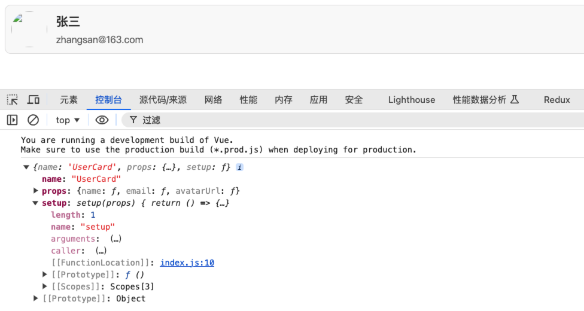
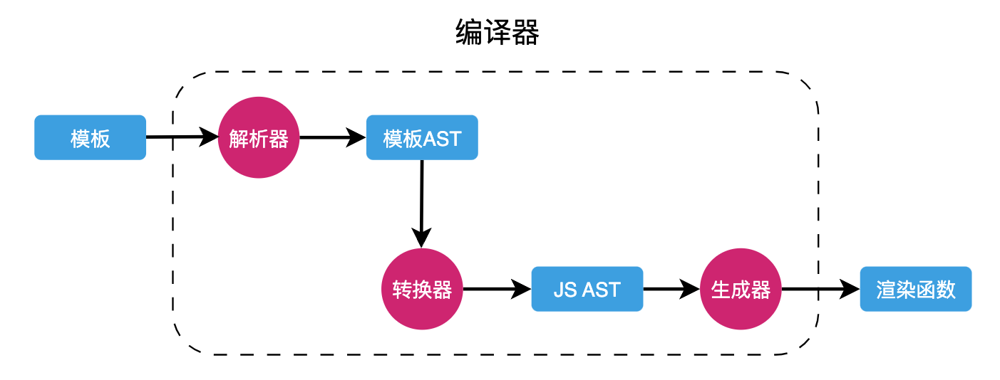

# 模版的本质

## 渲染函数

[h 函数](https://cn.vuejs.org/guide/extras/render-function.html)

渲染函数 h() 调用后会返回虚拟 DOM 节点。

实际上，Vue 里面的单文件组件是会被一个「模版编译器」进行编译的。编译后的结果并不存在模版语法，而是会把模版编译为渲染函数的形式。

这意味着，我们完全可以使用纯 JS 来书写组件。文件的内部直接调用渲染函数来描述你的视图。

> 提供单文件组件的目的是让开发者写代码更加的方便。

下面是使用渲染函数的形式描述了原本在模版中所描述的视图结构：

```js
import { h, defineComponent } from 'vue';

const UserCard = defineComponent({
  name: 'UserCard',
  props: {
    name: String,
    email: String,
    avatarUrl: String
  },
  setup(props) {
    return () =>
      h(
        'div',
        {
          class: 'user-card'
        },
        [
          h('img', {
            src: props.avatarUrl,
            class: 'avatar'
          }),
          h(
            'div',
            {
              class: 'user-info'
            },
            [h('h2', props.name), h('p', props.email)]
          )
        ]
      );
  }
});
```



甚至可以使用 options api 语法：

```js
import { h } from 'vue';

const UserCard = {
  name: 'UserCard',
  props: {
    name: String,
    email: String,
    avatarUrl: String
  },
  render() {
    return h(
      'div',
      {
        class: 'user-card'
      },
      [
        h('img', {
          src: this.avatarUrl,
          class: 'avatar'
        }),
        h(
          'div',
          {
            class: 'user-info'
          },
          [h('h2', this.name), h('p', this.email)]
        )
      ]
    );
  }
};
```

到此，我们知道 Vue 之所以提供模版的方式是为了让开发者描述试图的时候更加的轻松。Vue 在运行的时候本身是不需要什么模版的，他只需要渲染函数，调用这些渲染函数后得到的虚拟 DOM。

## 模版编译

单文件组件中所书写的模版对于模版编译器来说就是普通的字符串。

Vue 的模版语法：

```vue
<template>
  <div>
    <h1 :id="someId">Hello</h1>
  </div>
</template>
```

对于编码编译器来说只是一段字符串：

```js
'<template><div><h1 :id="someId">Hello</h1></div></template>';
```

模版编译器会对上面的字符串进行操作，最终生成的结果：

```js
function render() {
  return h('div', [h('h1', { id: someId }, 'Hello')]);
}
```

模版编译器在对模版字符串进行编译的时候是一点一点转化而来的，整个过程：



图片可以看到模版是经过编译器，最终变为了渲染函数。

编译器的内部又分为 3 块：

- 解析器：负责将模版字符串解析为对应的模版抽象语法树（AST）

- 转换器：将模版的抽象语法树转化为 JS 的抽象语法树

- 生成器：将 JS 抽象语法树生成最终的渲染函数

每一个步骤都依赖于上一个步骤的执行结果。

### 举例

模版：

```js
<div>
  <p>Vue</p>
  <p>React</p>
</div>
```

对于模版编译器来说就是一段字符串：

```js
'<div><p>Vue</p><p>React</p></div>';
```

首先是解析器，拿到这段字符串，对这段字符串进行解析，解析后得到一个一个的 token：

```js
[
  { type: 'tag', name: 'div' },
  { type: 'tag', name: 'p' },
  { type: 'text', content: 'Vue' },
  { type: 'tagEnd', name: 'p' },
  { type: 'tag', name: 'p' },
  { type: 'text', content: 'React' },
  { type: 'tagEnd', name: 'p' },
  { type: 'tagEnd', name: 'div' }
];
```

解析器还需要根据所得到的 token 生成一个 AST（模版的 AST）.

转化后的 AST：

```js
{
  "type": "Root",
  "children": [
    {
      "type": "Element",
      "tag": "div",
      "children": [
        {
          "type": "Element",
          "tag": "p",
          "children": [
              {
                "type": "Text",
                "content": "Vue"
              }
          ]
        },
        {
          "type": "Element",
          "tag": "p",
          "children": [
              {
                "type": "Text",
                "content": "React"
              }
          ]
        }
      ]
    }
  ]
}
```

到此，解析的工作就完成了。

接下来就是转换器登场，它需要将模版 AST 转化为 JS AST：

```js
{
  "type": "FunctionDecl",
  "id": {
      "type": "Identifier",
      "name": "render"
  },
  "params": [],
  "body": [
      {
          "type": "ReturnStatement",
          "return": {
              "type": "CallExpression",
              "callee": {"type": "Identifier", "name": "h"},
              "arguments": [
                  { "type": "StringLiteral", "value": "div"},
                  {"type": "ArrayExpression","elements": [
                        {
                            "type": "CallExpression",
                            "callee": {"type": "Identifier", "name": "h"},
                            "arguments": [
                                {"type": "StringLiteral", "value": "p"},
                                {"type": "StringLiteral", "value": "Vue"}
                            ]
                        },
                        {
                            "type": "CallExpression",
                            "callee": {"type": "Identifier", "name": "h"},
                            "arguments": [
                                {"type": "StringLiteral", "value": "p"},
                                {"type": "StringLiteral", "value": "React"}
                            ]
                        }
                    ]
                  }
              ]
          }
      }
  ]
}
```

最后就是生成器，根据 JS AST 生成具体的 JS 代码：

```js
function render() {
  return h('div', [h('p', 'Vue'), h('p', 'React')]);
}
```

下面是一个模板编译器大致的结构：

```js
function compile(template) {
  // 1. 解析器
  const ast = parse(template);
  // 2. 转换器：将模板 AST 转换为 JS AST
  transform(ast);
  // 3. 生成器
  const code = genrate(ast);

  return code;
}
```

## 编译的时机

整体会有两种情况：

1、运行时编译

2、预编译

### 运行时编译

例如下面的代码是直接通过 CDN 引入的 Vue：

```html
<body>
  <!-- 书写模板 -->
  <div id="app">
    <user-card :name="name" :email="email" :avatar-url="avatarUrl" />
  </div>

  <template id="user-card-template">
    <div class="user-card">
      
      <div class="user-info">
        <h2>{{ name }}</h2>
        <p>{{ email }}</p>
      </div>
    </div>
  </template>

  <script src="https://unpkg.com/vue@3/dist/vue.global.js"></script>
  <script>
    const { createApp } = Vue;

    const UserCard = {
      name: 'UserCard',
      props: {
        name: String,
        email: String,
        avatarUrl: String
      },
      template: '#user-card-template'
    };

    createApp({
      components: {
        UserCard
      },
      data() {
        return {
          name: 'John Doe',
          email: 'john@example',
          avatarUrl: './yinshi.jpg'
        };
      }
    }).mount('#app');
  </script>
</body>
```

上面的代码中也会涉及到模版代码和模版的编译，此时的模版编译就是在「运行时编译」。

### 预编译

预编译发生在工程化环境下，所谓预编译就是在打包的工程中就完成了模版的编译工作，浏览器拿到的打包后的代码是完全没有模版的。 

这里推荐一个插件：vite-plugin-inspect

安装该插件后在 vite.config.js 配置文件中简单配置一下：

```js
// vite.config.js
import Inspect from 'vite-plugin-inspect'

export default {
  plugins: [
    Inspect()
  ],
}
```

之后就可以在 http://localhost:5173/__inspect/ 里面看到每一个组件编译后的结果。