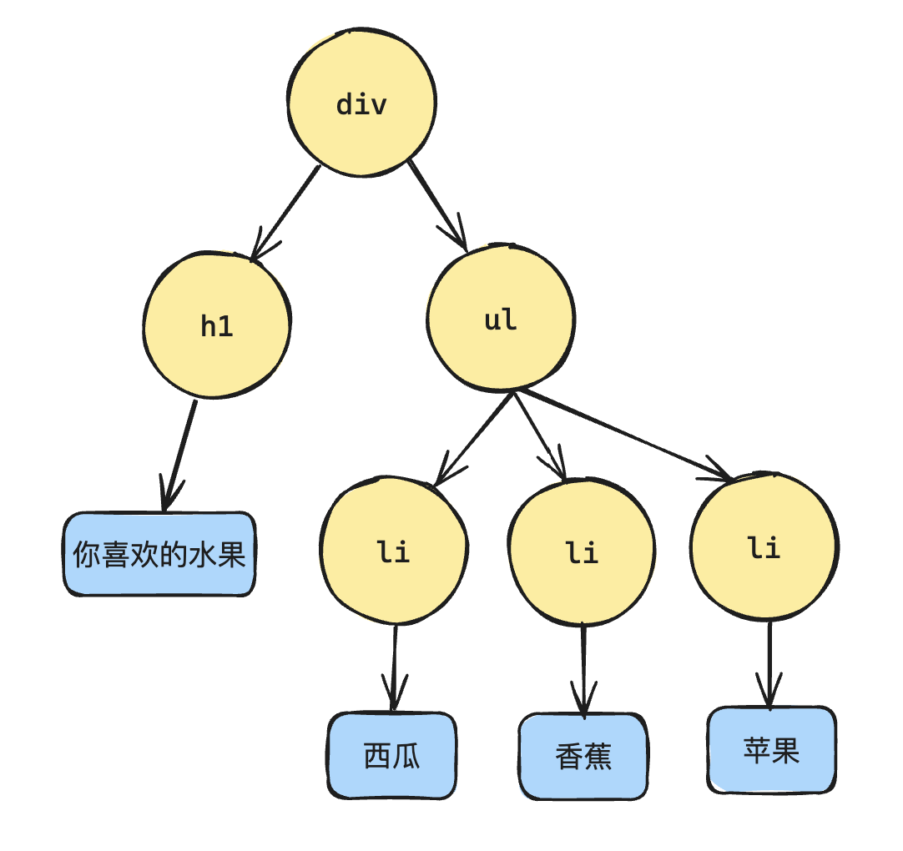
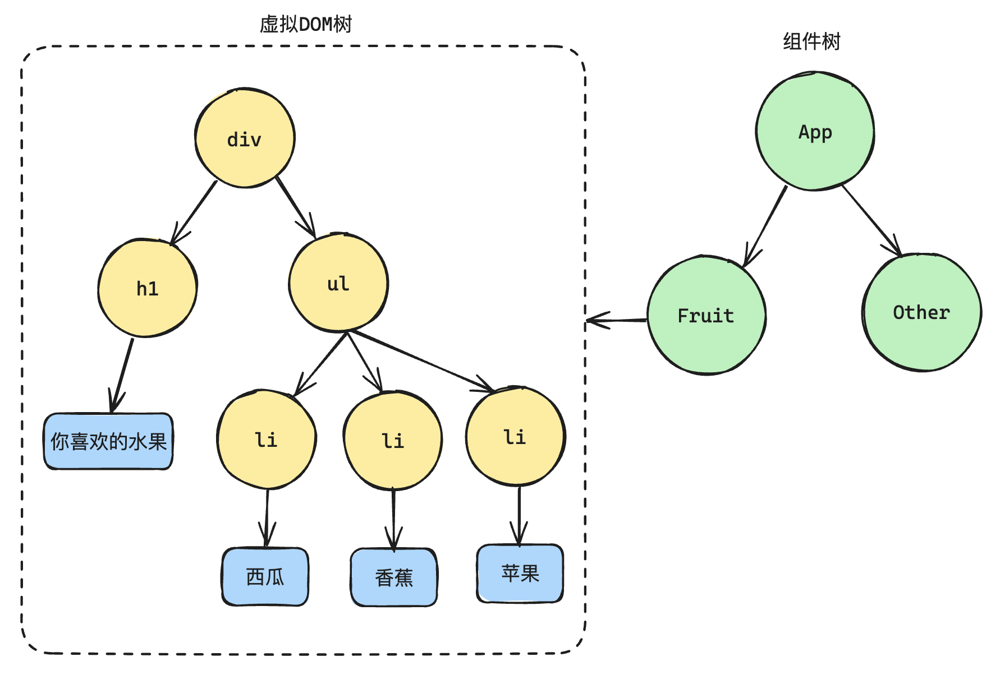
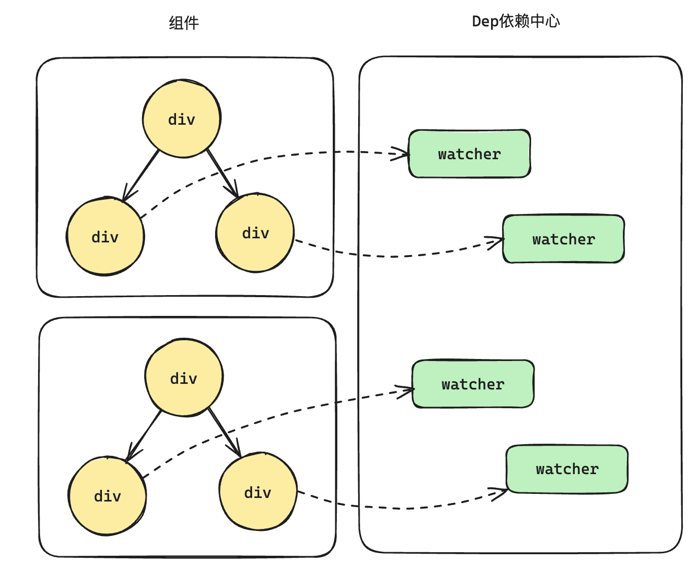
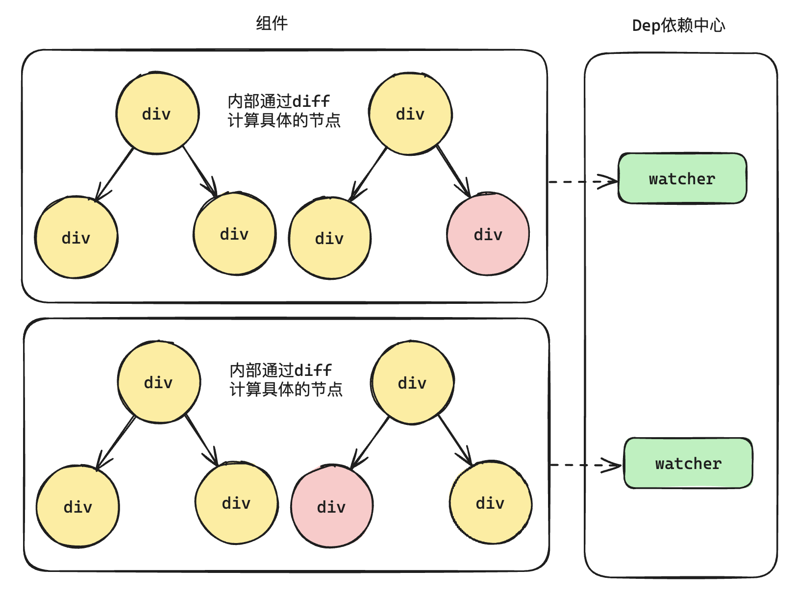

# 组件树和虚拟 DOM 树

最早的时候能接触到的树是 DOM 树：

```html
<div>
  <h1>你喜欢的水果</h1>
  <ul>
    <li>西瓜</li>
    <li>香蕉</li>
    <li>苹果</li>
  </ul>
</div>
```

上面的 HTML 结构就会形成 DOM 树结构：



组件树：

什么是组件树？需要先知道什么是组件！

组件的出现是为了解决什么问题？

组件本质上就是对一组 DOM 进行复用（先只看结构，不看行为和样式）。

可以把上面的 DOM 结构封装为一个组件,例如封装为 fruits 组件。该组件就可以用到其他的组件里面，组件和组件之间就形成了树结构，这就是组件树。

每个组件的背后都对应一组虚拟 DOM，虚拟 DOM 的背后又是真实 DOM 的映射：



接下来明确定义：

什么是组件树？指的是一个一个组件所形成的树结构。

什么是虚拟 DOM 树？指的是某一个组件内部的虚拟 DOM 树结构，**并非整个应用的虚拟 DOM 树结构**。

> 和 React 不同，在 React 中虚拟 DOM 树结构指的是整个应用。

理解清楚上面的概念后，有助于理解 Vue 中既有响应式又有虚拟 DOM 以及 diff 算法。

## 响应式

回归 Vue1.x 和 Vue2.x 的响应式：

~~响应式是 Vue1.x 和 Vue2.x 的核心特性，Vue3.x 依然保留了响应式，但 Vue3.x 的响应式和 Vue1.x、Vue2.x 的响应式不同。~~

- Object.defineProperty：getter（依赖收集） 和 setter（通知 watcher 进行更新）

- Dep：相当于观察者模式中的发布者

- Watcher：相当于观察者模式中的订阅者

> 当响应式数据发生变化后，发布者会通知所有的 Watcher 重新执行对应的函数。

但是在 Vue1.x 的时候没有虚拟 DOM，模版中每次引用一个响应式数据，就会生成一个 watcher：

```vue
<template>
  <div class="wrapper">
    <!-- 模版中没引用一次响应式数据，就会产生一个 watcher -->
    <!-- watcher1 -->
    <div class="msg1">{{ msg }}</div>
    <!-- watcher2 -->
    <div class="msg2">{{ msg }}</div>
  </div>
</template>

<script>
export default {
  data() {
    return {
      // 和 dep 一一对应，和 watcher 一 对 多
      msg: 'Hello Vue 1.0'
    };
  }
};
</script>
```

- 优点：这种设计的好处能够精准的知道哪个数据发生了变化。

- 缺点：当应用足够复杂的时候，一个应用里面会包含大量的组件，而这种设计又会导致一个组件对应多个 watcher，这样的设计是非常消耗资源的。



于是从 Vue2.0 版本开始引入了虚拟 DOM，2.0 的响应式有一个非常大的变化，将 watcher 的力度放大到了组件级别。也就是说一个组件对应一个 watcher，这样 watcher 的数量就会降低很多。

但是这种设计也会带来一个新的问题：1.x 的时候是可以精确的知道哪一个节点要进行更新，但是现在因为 watcher 是组件级别的，只能知道是哪个组件要进行更新，组件内部具体哪一个节点要进行更新是无法得知的。

这个时候虚拟 DOM 就派上用场了，通过对虚拟 DOM 的 diff 算法，可以精确的知道哪一个节点要进行更新。



Vue3 的响应式在架构层面是没有变化的，仍然是响应式+虚拟 DOM。

- 响应式：精确到组件级别，能够知道哪一个组件更新了。不过 Vue3 的响应式是基于 Proxy 的。

- 虚拟 DOM：通过 diff 算法来计算哪一个节点需要进行更新。不过 diff 算法也不再是 vue2 的 diff 算法，算法方面也有更新。