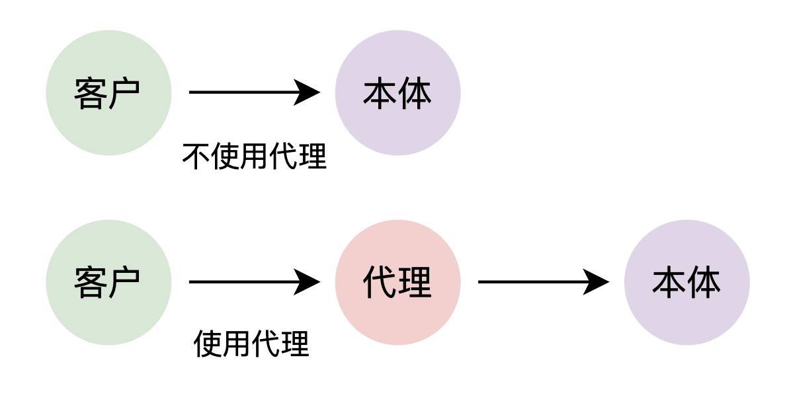
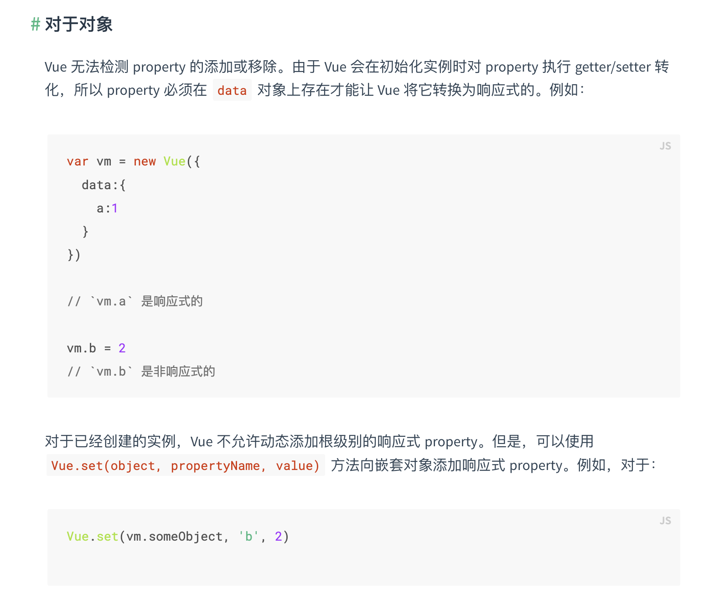

# 数据拦截的本质

## 数据拦截的方式

1、什么是拦截？

你想像一下你在路上开着车，从地点 A 前往地点 B. 本来能够一路畅通无阻，顺顺利利的到达地点 B，但是因为你路上不小心违反了交规，例如不小心开着远光灯一路前行，此时就会被警察拦截下来，对你进行批评教育加罚款。

这就是现实生活中的拦截，**在你做一件事情的中途将你打断，从而能够做一些额外的事情**。

2、数据拦截

所谓数据拦截，无外乎就是你在对数据进行操作，例如读数据、写数据的时候。

```js
const obj = { name: '张三' };
obj.name; // 正常读数据，直接就读了
obj.name = '李四'; // 正常写数据，直接就写了
```

我们需要一种机制，**在读写操作的中途进行一个打断，从而方便做一些额外的事情**。这种机制我们就称之为数据拦截。

这种拦截打断的场景其实有很多，比如 Vue 或者 React 里面的生命周期钩子方法，这种钩子方法本质上也是一种拦截，在组件从初始化到正常渲染的时间线里，设置了几个拦截点，从而方便开发者做一些额外的事情。

3、JS 中的数据拦截

JS 能够实现数据拦截的方式有哪些？

- Object.defineProperty，对应 Vue1.x 和 Vue2.x 的响应式；

- Proxy，对应 Vue3.x 的响应式；

4、API 的复习

- Object.defineProperty

这是 Object 上面的一个静态方法，用于给一个对象添加新的属性，除此之外还能够对该属性进行更为详细的配置。

```js
Object.defineProperty(obj, prop, descriptor);
```

- obj ：要定义属性的对象

- prop：一个字符串或 Symbol，指定了要定义或修改的属性键。

- descriptor：属性描述符。

  - value 设置属性值，默认值为 undefined.

  - writable 设置属性值是否可写，默认值为 false.

  - enumerable 设置属性是否可枚举，默认为 false.

  - configurable 是否可以配置该属性，默认值为 false. 这里的配置主要是针对这么一些点：

    - 该属性的类型是否能在数据属性和访问器属性之间更改

    - 该属性是否能删除

    - 描述符的其他属性是否能被更改

  - get 取值函数，默认为 undefined.

  - set 存值函数，默认为 undefined

> 数据属性：value、writable。访问器属性：getter、setter。数据属性和访问器属性默认是互斥。

也就是说，默认情况下，使用 Object.defineProperty( ) 添加的属性是不可写、不可枚举和不可配置的。

```js
function Student() {
  let stuName = '张三';
  Object.defineProperty(this, 'name', {
    get() {
      return stuName;
    },
    set(value) {
      if (!isNaN(value)) {
        stuName = '张三';
      } else {
        stuName = value;
      }
    }
  });
}

const stu = new Student();
console.log(stu.name);
stu.name = '李四';
console.log(stu.name);
stu.name = 100;
console.log(stu.name);
```

- Proxy

这是 ES6 中新增的一个 API，用于创建一个对象的代理，从而方便拦截和自定义一个基本操作（例如属性查找、赋值、枚举、函数调用等）。

```js
const p = new Proxy(target, handler);
```

- target：要使用 Proxy 包装的目标对象（可以是任何类型的对象，包括原生数组，函数，甚至另一个代理）。

- handler：定义代理对象的行为。

- 返回值，返回一个代理对象，之后外部对属性的读写都是针对这个代理对象。



案例：

```js
function Student() {
  const obj = {
    name: '张三'
  };
  return new Proxy(obj, {
    get(obj, prop) {
      return obj[prop] + '是个好学生';
    },
    set(obj, prop, value) {
      if (!isNaN(value)) {
        obj[prop] = '张三';
      } else {
        obj[prop] = value;
      }
    }
  });
}

const stu = new Student(); // stu 拿到的就是代理对象
console.log(stu.name); // 张三是个好学生
stu.name = '李四';
console.log(stu.name); // 李四是个好学生
stu.name = 100;
console.log(stu.name); // 张三是个好学生
```

## 共同点

1、都可以针对对象成员进行拦截

> 详见代码。

2、两者都可以拦截写入操作

> 详见代码。

3、都可以实现深度拦截

两者在实现深度拦截的时候，需要自己书写递归来实现，但是总而言之是能够实现深度拦截的。

> 详见代码。

## 差异点

1、拦截的广度

Vue3 的响应式，从原本的 Object.defineProperty 替换为了 Proxy.

之所以替换，就是因为两者在进行拦截的时候，无论是拦截的目标还是能够拦截的行为，都是不同的：

- Object.defineProperty 是针对**对象特定属性**的读写操作进行拦截

- Proxy 则是针对**一整个对象**的多种操作，包括属性的读取、赋值、属性的删除、属性描述符的获取和设置、原型的查看、函数调用等行为能够进行拦截。

如果是使用 Object.defineProperty ，一旦后期给对象新增属性，是无法拦截到的，因为 Object.defineProperty 在设置拦截的时候是针对的特定属性，所以新增的属性无法被拦截。

但是 Proxy 就不一样，它是针对整个对象，后期哪怕新增属性也能够被拦截到。

```js
function deepProxy(obj) {
  return new Proxy(obj, {
    get(obj, prop) {
      console.log(`读取了${prop}属性`);
      if (typeof obj[prop] === 'object') {
        // 递归的再次进行代理
        return deepProxy(obj[prop]);
      }
      return obj[prop];
    },

    set(obj, prop, value) {
      console.log(`设置了${prop}属性`);
      if (typeof value === 'object') {
        return deepProxy(value);
      }
      obj[prop] = value;
    },

    deleteProperty(obj, prop) {
      console.log(`删除了${prop}属性`);
      delete obj[prop];
    },

    getPrototypeOf(obj) {
      console.log('拦截获取原型');
      return Object.getPrototypeOf(obj);
    },

    setPrototypeOf(obj, proto) {
      console.log('拦截设置原型');
      return Object.setPrototypeOf(obj, proto);
    }
  });
}
```

理解了上面的差异点之后，你就能够完全理解 Vue2 的响应式会有什么样的缺陷：



2、性能上的区别

大多数情况下，Proxy 是高效的。

但是不能完全断定 Proxy 就一定比 Object.defineProperty 效率高，因为这还是得看具体的场景。

如果你需要拦截的**操作类型较少，且主要集中在某些特定属性上**，那么 Object.defineProperty 可能提供更好的性能。

- 但是只针对某个特定属性的拦截场景较少，一般都是需要针对一个对象的所有属性进行拦截；

- 此时如果需要拦截的对象结构复杂（如需要递归到嵌套对象）或者需要拦截的操作种类繁多，那么使用这种方式就会变得复杂且效率低下；

如果你需要全面地拦截对象的各种操作，那么 Proxy 能提供更强大和灵活的拦截能力，尽管可能有一些轻微的性能开销。