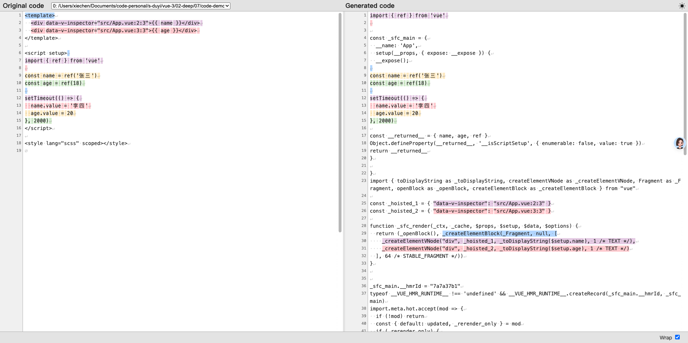

# 响应式和组件渲染

回顾一下之前的内容：

- 模版的本质：对应的就是 render() 渲染「函数」，执行之后返回一段虚拟 DOM（用力描述真实 DOM 的数据结构）；

- 响应式的本质：当数据变化时，依赖该数据的「函数」重新执行（也包括渲染函数）；

假如 render 函数运行的时候用到了响应式数据回怎么样？

结果很简单，那就是这个 render 函数会和响应式数据关联起来，当响应式数据发生变化的时候，所关联的 render 函数就会重新运行，从而得到新的虚拟 DOM 结构，然后渲染器就会根据新的虚拟 DOM 结构去更新真实的 DOM 结构，从而在视觉感官上看到的是界面的变化。

> 这里说的重新运行 render，其实还不是最准确的表达，实际上源码内部是和 updateComponent 函数关联起来的，这个函数内部调用了 render 函数。

## 在看模版编译

```vue
<template>
  <div>{{ name }}</div>
  <div>{{ age }}</div>
</template>

<script setup>
import { ref } from 'vue';
const name = ref('张三');
const age = ref(18);
</script>
```

在上面的代码中，模版用到了两个响应式数据，在模版中使用 ref 是会自动解包 value 的，因此这里就相当于读取 .value 值，读取 .value 值就会产生读取的拦截，这两个响应式数据就会被模版背后所对应的渲染函数关联起来，有了依赖关系。

> 在模版内部回对响应式数据进行解包，实际上读取的还是 .value 属性，当读取 .value 属性的时候响应式数据和 render 函数就产生依赖映射。

有了依赖关系之后，响应式数据的变化就会导致渲染函数（被监控的函数）的重新执行，得到新的虚拟 DOM，从让让试图得到更新。

下面是使用 vite-plugin-vue-devtools 插件进行编译分析，从而验证上面的说法：



在 setup 函数中定义响应书数据，会转变为一个 _returned_ 的一个对象的访问器属性，针对这两个属性进行读取和赋值的时候就会被拦截到。

在 _sfc_render 渲染函数中，setup 所返回的对象通过 $setup 参数可以拿到，在渲染函数中，通过 $setup.name 和 $setup.age 访问了这两个访问器属性，产生读取行为的拦截，从而建立了依赖关系。（这句话有问题）

## 为什么 Vue 能狗实现精准的更新

Vue 的更新是组件级别的，通过响应式，能够知道具体是哪个组件更新了。因为响应式数据是和 render 函数进行关联的。整个 render 对应的就是一整个组件的结构，会有只有响应式数据一变化，render 函数就会重新执行，生成组件新的虚拟 DOM 结构。

之后要知道具体是哪一个节点更新就需要靠 diff 算法了。

- vue2 使用的是双端 diff

- vue3 使用的是快速 diff（比 Vue2 又提升了很多）

## 为什么 Vue 能够实现数据共享

在 Vue 中是可以轻松实现数据共享的。只需要将响应式数据单独提取出来，然后多个组件依赖这个响应式数据，只有只要响应式数据一变化，依赖该数据的组件自然也会重新运行 render，然后渲染器渲染新的 DOM。

完整案例，详见 ../code-demo/src/store

那么 pinia 的作用呢？

理论上组件之间共享公共数据，pinia 确实没有什么作用了。

但是 pinia 是经过完善的测试的，会带来很多的附加的价值，例如：

- 开发工具的支持

- 热替换

- 插件机制

- 自动补全

- SSR

而且相比一个单纯的响应式数据，Pinia 语义上面更好一些：

- 一个单独抽出来的 reactive 对象，从语义上来讲可能是任何东西；

- 一个 Pinia 对象，从语义上来讲就是全局共享数据的仓库；

这样其实也能一定程度降低开发者的心智负担，提高代码的可读性；