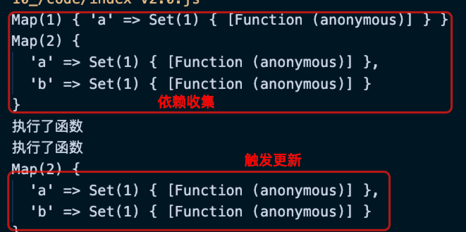
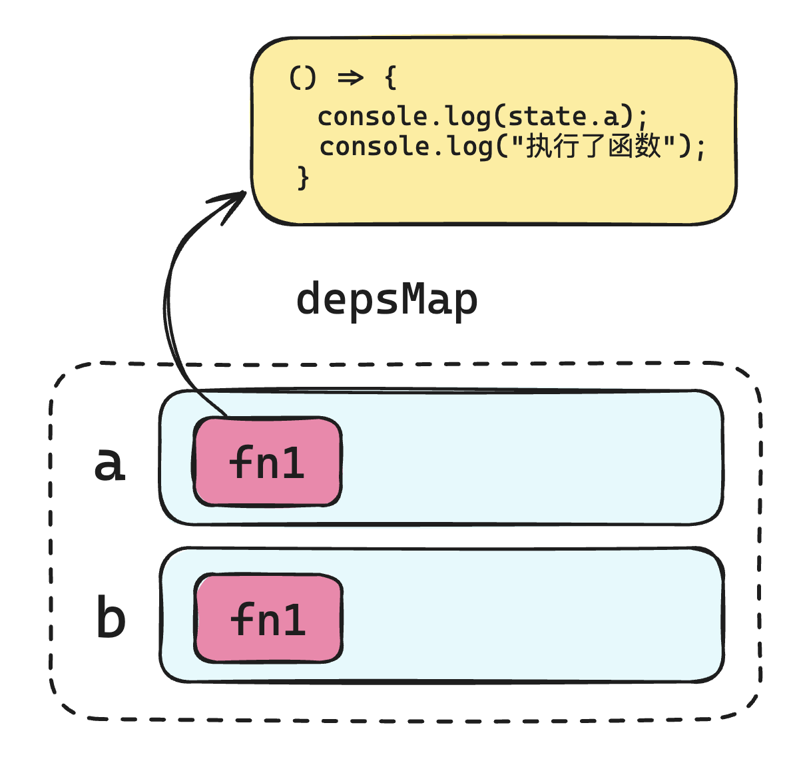
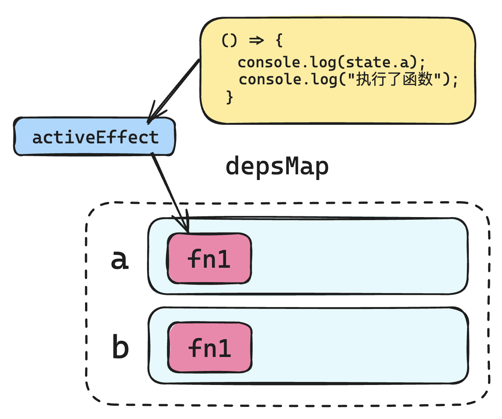
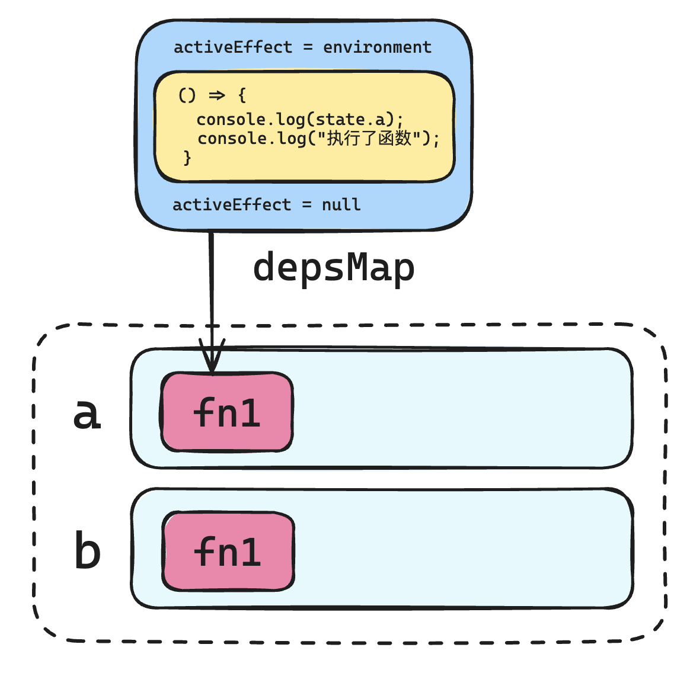
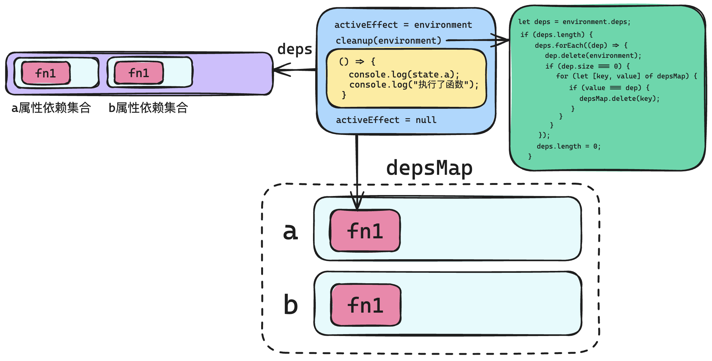
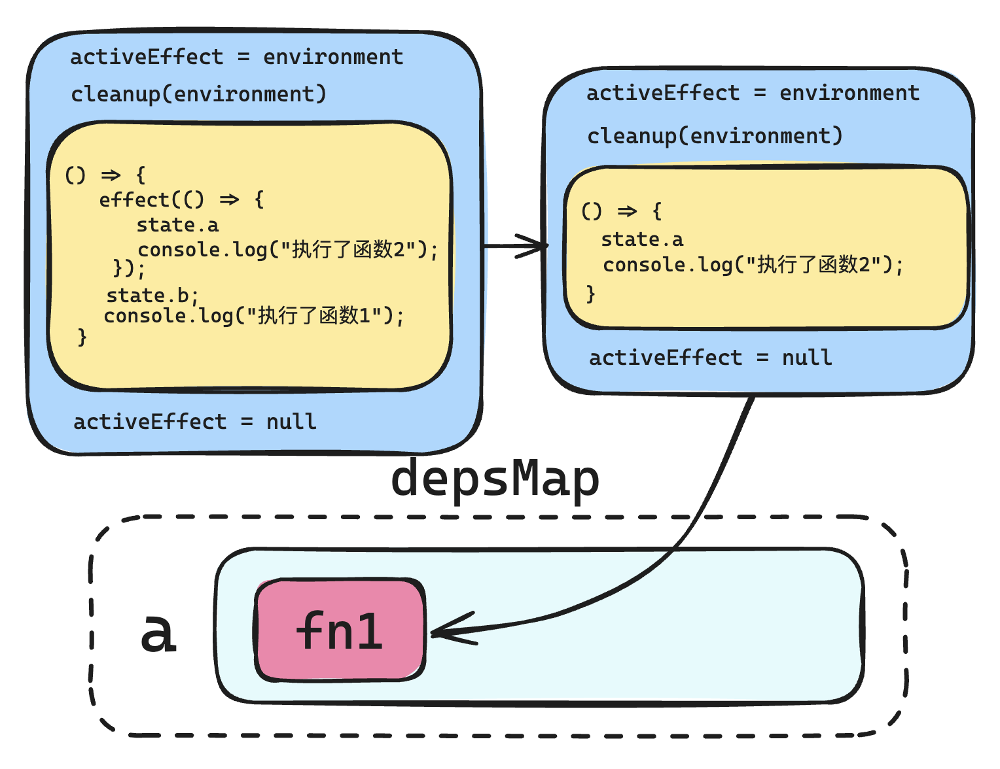

# 图解 effect

effect 的作用：就是将函数和数据进行关联，当数据发生变化时，所关联的函数会全部重新执行。

回忆 watchEffect 的用法：

```js
watchEffect(() => {
  console.log('运行');
  state;
  state.value;
  state.value.a;
  n;
});

setTimeout(() => {
  // 会重新运行，因为是对 .value 的操作
  state.value = { a: 3 };
}, 500);
```

watchEffect 函数会将回调函数执行一次，就会发现哪些操作涉及到响应式数据的读取。

这里就会整理出 `state.value`、`state.value.a`。

effect 函数的设计：

```js
// 原始对象
const data = {
    a: 1,
    b: 2,
    c: 3
}

// 代理对象
const state = new Proxy(data, {...});

effect(()=>{
    // 希望 state.a 和回调函数产生关联
    console.log(state.a);
})
```

在上面的代码中，向 effect 方法传入回调函数，访问了 state 的 a 成员，然后我们期望 a 这个成员和这个回调函数产生关联。

第一版本实现如下：

```js
// 记录当前的函数
let activeEffect = null;
// 保存数据和函数的依赖关系
const depsMap = new Map();

// 收集器
function track(target, key) {
  // 建立依赖关系
  // console.log('收集器：', target, key);
  if (activeEffect) {
    // 根据属性值获取依赖的函数集合
    let deps = depsMap.get(key);

    if (!deps) {
      // 如果没有，则创建一个新的集合
      deps = new Set();
      depsMap.set(key, deps);
    }

    // 将依赖的函数添加到集合中
    deps.add(activeEffect);
  }
}

// 派发器
function trigger(target, key) {
  //   console.log('派发器：', target, key);

  const deps = depsMap.get(key);
  if (deps) {
    deps.forEach((fn) => fn());
  }
}

// 原始对象
const data = {
  a: 1,
  b: 2,
  c: 3
};

// 代理对象
const state = new Proxy(data, {
  get(target, key) {
    track(target, key);
    return Reflect.get(target, key);
  },
  set(target, key, value) {
    let result = Reflect.set(target, key, value);
    trigger(target, key);
    return result;
  }
});

/**
 * @description 聚焦点，副作用函数
 * @param {Function} fn 回调函数
 */
function effect(fn) {
  activeEffect = fn;
  fn();
  // 清空
  activeEffect = null;
}

effect(() => {
  console.log('执行了函数～');
  // 这里在访问 .a 属性，会触发 get 进行依赖收集
  console.log(state.a);
});

// 这里在修改 .a 属性，会触发 set 进行派发
state.a = 10;
```

第一版实现，每个属性对应一个 Set 集合，该集合里面是所依赖的函数，所有属性与其对应的依赖函数集合形成一个 map 结构，如下图所示：



activeEffect 起到一个中间变量的作用，临时存储这个回调函数，等依赖收集完成后，再将这个临时变量设置为空即可。


问题一：每一次运行回调函数，都应该确定新的依赖关系。

```js
effect(() => {
  // 第一次运行依赖只有 .a 和 .b
  if (state.a === 1) {
    state.b;
  } else {
    // 第二次运行依赖只有 .a 和 .c
    state.c;
  }
});
```

上面的代码中，两次运行回调函数，所建立的依赖关系应该是不一样的！

第一次运行依赖如下：

```js
Map(1) { 'a' => Set(1) { [Function (anonymous)] } }
Map(2) {
  'a' => Set(1) { [Function (anonymous)] },
  'b' => Set(1) { [Function (anonymous)] }
}
执行了函数
```



执行 state.a = 100

```js
函数执行了～
Map(1) { 'a' => Set(1) { [Function (anonymous)] } }
Map(2) {
  'a' => Set(1) { [Function (anonymous)] },
  'b' => Set(1) { [Function (anonymous)] }
}
函数执行了～
Map(2) {
  'a' => Set(1) { [Function (anonymous)] },
  'b' => Set(1) { [Function (anonymous)] }
}
Map(2) {
  'a' => Set(1) { [Function (anonymous)] },
  'b' => Set(1) { [Function (anonymous)] }
}
```

当 a 的值修改为 100 后，依赖关系应该重新建立，也就是说：

- 第一次运行：建立 a、b 依赖

- 第二次运行：建立 a、c 依赖

那么现在 a 的值明明已经变成 100 了，为什么重新执行回调函数的时候，没有重新建立依赖呢？



**第一次建立依赖关系的时候，是将依赖函数赋值给 activeEffect，最终是通过 activeEffect 这个中间变量将依赖函数添加进依赖列表的。**

依赖函数执行完毕后，activeEffect 就设置为了 null，之后 a 成员的值发生改变，重新运行的是回调函数，但是 activeEffect 的值依然是 null，这就会导致 track 中依赖收集的代码根本进不去：

```js
function track(target, key) {
  if (activeEffect) {
    // ...
  }
}
```

怎么办呢？也很简单，我们在收集依赖的时候，**不再是仅仅收集回调函数，而是收集一个包含 activeEffect 的环境**，继续改造 effect：

```js
function effect(fn) {
  const environment = () => {
    activeEffect = environment;
    fn();
    // 清空
    activeEffect = null;
  };
  environment();
}
```

这里 activeEffect 对应的值，不再是像之前那样是回调函数，而是一整个 environment 包含环境信息的函数，这样当重新执行依赖的函数的时候，执行的也就是这个环境函数，而环境函数的第一行就是 activeEffect 赋值，这样就能够正常的进入到依赖收集环节。



问题二：旧的依赖没有删除

解决方案：在执行 fn 方法之前，先调用了一个名为 cleanup 的方法，该方法的作用就是用来清除依赖。

```js
function cleanup(environment) {
  let deps = environment.deps; // 拿到当前环境函数的依赖（是个数组）
  if (deps.length) {
    deps.forEach((dep) => {
      dep.delete(environment);
      if (dep.size === 0) {
        for (let [key, value] of depsMap) {
          if (value === dep) {
            depsMap.delete(key);
          }
        }
      }
    });
    deps.length = 0;
  }
}
```



测试多个依赖函数：

```js
effect(() => {
  console.log('函数1执行了～');
  // 第一次运行依赖只有 .a 和 .b
  if (state.a === 1) {
    state.b;
  } else {
    // 第二次运行依赖只有 .a 和 .c
    state.c;
  }
});

effect(() => {
  console.log('函数2执行了～');
  console.log(state.c);
});

// 这里在修改 .a 属性，会触发 set 进行派发
state.a = 10;
```

```js
effect(() => {
  if (state.a === 1) {
    state.b;
  } else {
    state.c;
  }
  console.log('执行了函数1');
});
effect(() => {
  console.log(state.a);
  console.log(state.c);
  console.log('执行了函数2');
});
state.a = 2;
```

第二个案例出现无限循环。

在 track 函数中，每次 state.a 被访问时，都会重新添加当前的 activeEffect 到依赖集合中。

而在 trigger 函数中，当 state.a 被修改时，会触发所有依赖 state.a 的 effect 函数，这些 effect 函数中又会重新访问 state.a，从而导致了无限循环。

具体来讲：

1. 初始执行 effect 时，state.a 的值为 1，因此第一个 effect 会访问 state.b，第二个 effect 会访问 state.a 和 state.c。

2. state.a 被修改为 2 时，trigger 函数会触发所有依赖 state.a 的 effect 函数。
   第二个 effect 函数被触发后，会访问 state.a，这时 track 函数又会把当前的 activeEffect 添加到 state.a 的依赖集合中。

3. 因为 state.a 的值被修改，会再次触发 trigger，导致第二个 effect 函数再次执行，如此循环往复，导致无限循环。

要解决这个问题，可以在 trigger 函数中添加一些机制来防止重复触发同一个 effect 函数，比如使用一个 Set 来记录已经触发过的 effect 函数：

```js
function trigger(target, key) {
  const deps = depsMap.get(key);
  if (deps) {
    const effectsToRun = new Set(deps); // 复制一份集合，防止在执行过程中修改原集合
    effectsToRun.forEach((effect) => effect());
  }
}
```

测试嵌套函数：

```js
effect(() => {
  effect(() => {
    state.a
    console.log("执行了函数2");
  });
  state.b;
  console.log("执行了函数1");
});
```

会发现所建立的依赖又不正常了：

```js
执行了函数2
Map(1) { 'a' => Set(1) { [Function: environment] { deps: [Array] } } }
执行了函数1
Map(1) { 'a' => Set(1) { [Function: environment] { deps: [Array] } } }
```

究其原因，是目前的函数栈有问题，当执行到内部的 effect 函数时，会将 activeEffect 设置为 null，如下图所示：



解决方案：模拟函数栈的形式。