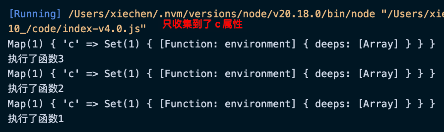

# 图解 effect

effect 方法的作用就是将函数和数据进行关联。

回忆 watchEffect:

```js
import { ref, watchEffect } from "vue";
const state = ref({ a: 1 });
const k = state.value;
const n = k.a;

// 这里就会整理出 state.value、state.value.a
watchEffect(() => {
    console.log("运行");
    state;
    state.value;
    state.value.a;
    n;
});

setTimeout(() => {
    state.value = { a: 3 }; // 要重新运行，因为是对 value 的写入操作
}, 500);
```

effect 函数的设计：

```js
// 原始对象
const data = {}

// 得到一个代理对象
const proxy = new Proxy(data, { ... });

effect(() => {
    console.log(proxy.a);
})
```

上面的示例中，effect 的回调函数访问了 a 属性，期望 a 属性和回调函数建立关联。

实现 effect Version 1.0 版本。

## effect Version 1.0 的问题

1、每次运行回调函数都应该重新建依赖关系。

```js
effect(() => {
    if (state.a === 1) {
        state.b;
    } else {
        state.c;
    }
    console.log("执行了函数");
});
```


最新的依赖关系应该是 {a:[],c:[]}。由于我们代码 activeEffect = null 的存在，在 effect 函数执行完成之后 activeEffect 一直都是 null，所以执行 track 的时候 if (activeEffect){ ... } 这个条件判断会失败，所以无法建立最新的依赖关系。

优化：收集依赖的时候不再收集的是一个函数，而是一个包含 effect 的环境。

```js
function effect(callback) {
    // 创建一个函数
    const environment = () => {
        debugger;
        activeEffect = environment;
        callback();
        activeEffect = null;
    };
    environment();
}
```

2、旧属性（b 属性）的依赖没有删除掉。

优化：每次重新执行回调函数之前都调用 cleanUp 清除一下依赖关系。

```js
// 重点函数，副作用函数
function effect(callback) {
    // 创建一个函数
    const environment = () => {
        activeEffect = environment;
        // 执行回调函数之前先清理一下旧的依赖
        cleanup(environment);

        callback();
        activeEffect = null;
    };
    // 用于记录改函数被哪些属性依赖
    environment.deeps = [];
    environment();
}
```

```js
function cleanup(environment) {
    // 拿到当前环境函数的依赖
    // environment 可能被多个属性依赖
    let deps = environment.deeps;

    if (deps.length) {
        deps.forEach((deep) => {
            deep.delete(environment);

            if (deep.size === 0) {
                for (const [key, value] of deepsMap) {
                    deepsMap.delete(key);
                }
            }
        });
        deps.length = 0;
    }
}
```

完成 effect Version 2.0 版本。

## effect Version 2.0 的问题

测试调用多个 effect 函数。

```js
// 以下代码正常 ✅

effect(() => {
    if (state.a === 1) {
        state.b;
    } else {
        state.c;
    }
    console.log("执行了函数1");
});
effect(() => {
    console.log(state.c);
    console.log("执行了函数2");
});
state.a = 2;
```

```js
// 以下代码会造成循环调用 ❌

effect(() => {
    if (state.a === 1) {
        state.b;
    } else {
        state.c;
    }
    console.log("执行了函数1");
});
effect(() => {
    console.log(state.a);
    console.log(state.c);
    console.log("执行了函数2");
});
state.a = 2;
```

优化：在 trigger 函数内添加一些机制，防止重复触发同一个 effect 函数。

```js
function trigger(target, key) {
    // 拿到一个 Set 集合
    const deps = deepsMap.get(key);

    if (deps) {
        // 复制一份
        const effectToRun = new Set(deps);
        effectToRun.forEach((effect) => effect());
    }
}
```

完成 effect Version 3.0 版本。

## effect Version 3.0 的问题

1、测试嵌套函数执行是否正常。

```js
effect(() => {
    effect(() => {
        // 一旦嵌套的函数执行完毕，之后的依赖就都收集不到了
        effect(() => {
            state.c;
            console.log("执行了函数3");
        });

        state.a;
        console.log("执行了函数2");
    });

    state.b;
    console.log("执行了函数1");
});
```



优化：模拟函数栈。

```js
// 重点函数，副作用函数
function effect(callback) {
    // 创建一个函数
    const environment = () => {
        activeEffect = environment;

        // 将环境推入栈内
        effectStack.push(environment);

        // 执行回调函数之前先清理一下旧的依赖
        cleanup(environment);

        callback();
        // activeEffect = null;

        effectStack.pop();
        activeEffect = effectStack[effectStack.length - 1];
    };
    // 用于记录改函数被哪些属性依赖
    environment.deeps = [];
    environment();
}
```

## 资料


- [图解EFFECT](https://gitee.com/dev-edu/vue3/blob/master/03.%20%E6%B7%B1%E5%85%A5%E6%9C%AC%E8%B4%A8/11.%20%E4%B8%AD%E5%9C%BA%E6%8F%92%E6%92%AD-%E5%9B%BE%E8%A7%A3Effect/%E8%AF%BE%E4%BB%B6%E8%B5%84%E6%96%99/%E5%9B%BE%E8%A7%A3EFFECT.md)

[测试](./index.excalidraw)