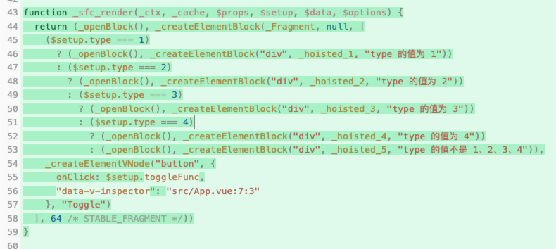
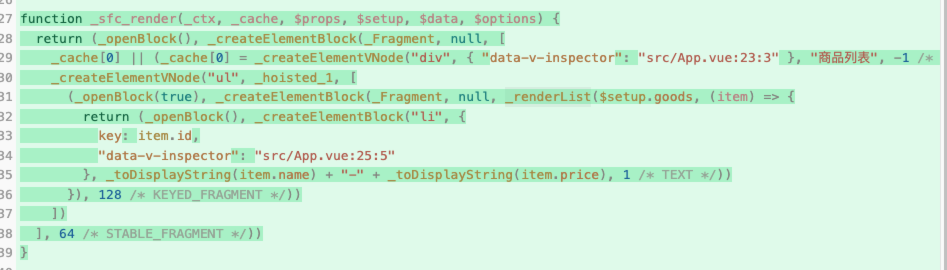
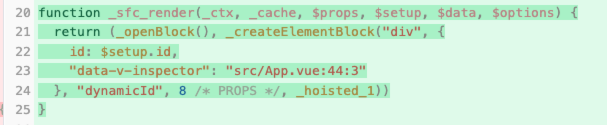
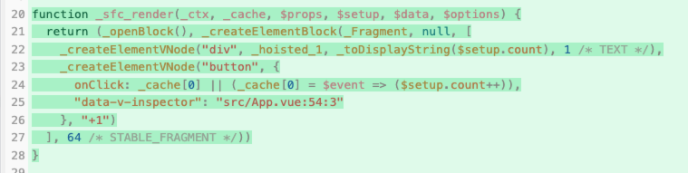

# 指令的本质

目前为止，我们学过了很多 Vue 的内置指令，例如：

- v-model

- v-if

- v-for

- v-on

- v-bind

- v-text

- v-html

- v-cloak

- v-once

这些指令，我们都可以在模板中使用，并且它们都有各自的含义和用法。那么，这些指令的本质是什么呢？

结合 vite-plugin-vue 插件的编译结果进行分析指令的本质。

## 案例 v-for

```vue
<template>
  <div v-if="type === 1">type 的值为 1</div>
  <div v-else-if="type === 2">type 的值为 2</div>
  <div v-else-if="type === 3">type 的值为 3</div>
  <div v-else-if="type === 4">type 的值为 4</div>
  <div v-else>type 的值不是 1、2、3、4</div>
  <button @click="toggleFunc">Toggle</button>
</template>
```



对于 v-if 指令，背后对应的就是三目运算符写的不同分支。每一次 $setup.type 的值的变化，就会导致渲染函数重新执行，然后就会进入不同的分支。

## v-for 的案例

```vue
<template>
  <div>商品列表</div>
  <ul>
    <li v-for="item in goods" :key="item.id">{{ item.name }}-{{ item.price }}</li>
  </ul>
</template>
```



生成的渲染函数里面使用了名为 \_renderList 的内部方法。

renderList：packages/runtime-core/src/helpers/renderList.ts

## 案例 v-bind

```vue
<template>
  <div v-bind:id>dynamicId</div>
</template>
```



这里就是将 $setup.id 的值作为 div 的 id 属性的值，这里的涉及到了响应式数据的读取，因此 $setup.id 的值变化，就会导致整个渲染函数重新执行，div 对应的属性值也会发生变化。

## 案例 v-on

```vue
<template>
  <div>{{ count }}</div>
  <button v-on:click="count++">+1</button>
</template>
```



编译结果就是为 button 元素添加了 click 事件，该事件对应的事件处理函数为：

```js
$event => $setup.count++
```

## 总结

通过案例我们对比编译前后的结果，可以得出一个结论：

最终编译出来的渲染函数，根本不存在什么指令，**不同的指令会被编译为不同的处理**。