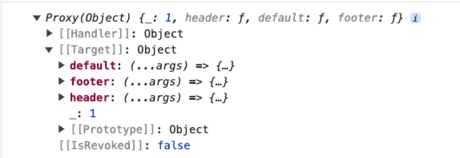
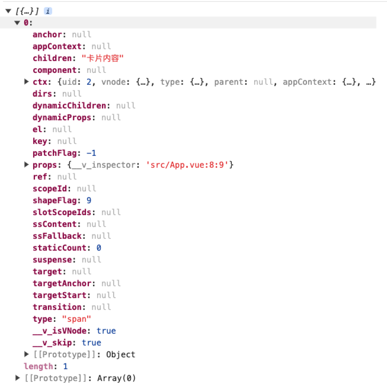

# 插槽的本质

复习插槽的概念：

- 子组件：通过 slot 标签设置插槽；

- 父组件：使用子组件的时候，往 slot 的位置插入内容；

插槽使用层面的本质：父组件向子组件传递模版的内容。

- 默认插槽：具有默认的一些内容；

- 具名插槽：通过 name 属性指定插槽的名称；

- 作用域插槽：数据来自于子组件，通过插槽的形式传递给父组件使用；

## 父组件传递内容的本质

传递的是一个对象，对象的属性的值就是一个函数，函数的返回值就是插槽的内容。

```js
{
    default: function(){ ... },
    xxx: function(){ ... },
    yyy: function(){ ... }
}
```

对于上面的案例来讲，父组件传递的就是这样的一个对象：

```js
{
    default: function(){
        // 注意返回值是对应结构的虚拟 DOM
        return (<span>卡片内容</span>);
     },
    header: function(){
        return (<span>卡片头部</span>)
    },
    footer: function(){
        return (<span>卡片底部</span>)
    }
}
```

父组件给子组件传递过去的插槽本质上是函数，通过调用这些函数能够得到对应结构的虚拟 DOM。

```js
function _sfc_render(_ctx, _cache, $props, $setup, $data, $options) {
  return (
    _openBlock(),
    _createElementBlock('div', _hoisted_1, [
      _createVNode(
        $setup['CardComponent'],
        { 'data-v-inspector': 'src/App.vue:3:5' },
        {
          header: _withCtx(
            () =>
              _cache[0] ||
              (_cache[0] = [
                _createElementVNode(
                  'span',
                  { 'data-v-inspector': 'src/App.vue:5:9' },
                  '卡片头部',
                  -1 /* HOISTED */
                )
              ])
          ),
          default: _withCtx(
            () =>
              _cache[1] ||
              (_cache[1] = [
                _createElementVNode(
                  'span',
                  { 'data-v-inspector': 'src/App.vue:8:9' },
                  '卡片内容',
                  -1 /* HOISTED */
                )
              ])
          ),
          footer: _withCtx(
            () =>
              _cache[2] ||
              (_cache[2] = [
                _createElementVNode(
                  'span',
                  { 'data-v-inspector': 'src/App.vue:11:9' },
                  '卡片底部',
                  -1 /* HOISTED */
                )
              ])
          ),
          _: 1 /* STABLE */
        }
      )
    ])
  );
}
```

## 子组件设置插槽的本质

其实就是对父组件传递过来的函数进行调用，得到对应的虚拟 DOM。

```js
// 该对象是父组件传递过来的对象
const slots = {
    default: function(){ ... },
    header: function(){ ... },
    footer: function(){ ... }
}
// 调用方法，得到对应的虚拟 DOM
slots.default();
slots.header();
slots.footer();
```

## 验证

不能通过 SFC 的形式，可以使用纯 JS 的形式。





作用域插槽的本质就是，子组件调用的时候传递参数过去即可。

```js
if (slots.header) {
  headerSlotVNode = slots.header({ title: '标题' });
} else {
  headerSlotVNode = h('div', null, '默认标题');
}
```
