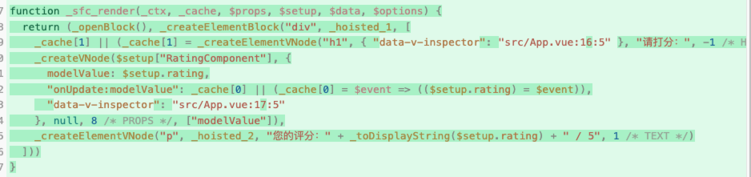

# v-model 的本质

v-model 的用法，总结就两个场景：

1、表单元素和响应式数据的双向绑定

2、父子组件传递数据

## 和表单元素的绑定

```vue
<template>
  <div>
    <p>输入的内容为：{{ message }}</p>
    <input v-model="message" type="text" placeholder="请输入内容" />
  </div>
</template>

<script setup>
import { ref } from 'vue';

const message = ref('hello world');
</script>
```

在上面的案例中，input 元素和 message 这个响应式数据做了双向绑定。

input 输入的值会影响 message 这个响应式数据的值；message 这个响应式数据的值也会影响 input 元素的值。

## 和子组件进行绑定

```vue
<template>
  <div class="app-container">
    <h1>请打分：</h1>
    <RatingComponent v-model="rating" />
    <p>您的评分：{{ rating }} / 5</p>
  </div>
</template>

<script setup>
import { ref } from 'vue';

import RatingComponent from './components/RatingComponent.vue';

const rating = ref(3);
</script>
```

```vue
<template>
  <div>
    <span v-for="star in 5" :key="star" class="star" @click="setRating(star)">
      {{ model >= star ? '★' : '☆' }}
    </span>
  </div>
</template>

<script setup>
// 接收父组件传递过来的mode属性
const model = defineModel();

function setRating(star) {
  model.value = star;
}
</script>
```

父组件通过 v-model 将自身的数据传递给子组件，子组件通过 defineModel 来拿到父组件传递过来的数据。拿到数据之后不仅可以使用，还可以进行修改。

## v-model 的本质

首先我们分析第一个场景：和表单元素进行绑定。


编译结果看出，v-model 会被展开为一个名为 onUpdate:modelValue 的自定义事件，该事件对应的事件处理函数：`$event => (($setup.message) = $event))`。

这就解释了输入框输入值的时候，会影响响应式数据。

而输入框的 value 本身又是和 $setup.message 绑定在一起的，$setup.message 一变化，就回导致渲染函数重新执行，从而看到输入框里面的内容发生了变化。

接下来分析第二个场景，和子组件使用 v-model 进行绑定。

父组件：



父组件会向子组件传递一个名为 modelValue 的 props，props 对应的值就是 $setup.rating，这正是父组件上面的状态。

除此之外，也传递了一个名为 onUpdate:modelValue 的自定义事件，该事件对应的事件处理函数：`$event => (($setup.rating) = $event))`。

该事件处理函数负责的事情就是将接收到的值更新组件本身的数据 rating。

子组件：


对于子组件来讲，就可以通过 modelValue 这个 props 来拿到父组件传递过来的数据，并且可以模版中使用该数据。

当更新的数据的时候，就去触发父组件传递过来的 onUpdate:modelValue 事件，并且将新的值传递过去。

至此，你对官网的这句话：

> defineModel 是一个便利宏。编译器将其展开为以下内容：
> 一个名为 modelValue 的 prop，本地 ref 的值与其同步；
> 一个名为 update:modelValue 的事件，当本地 ref 的值发生变更时触发。

有时候我们可以在子组件上面使用具名的 v-model，此时展开的 props 和自定义事件名称会有所不同。


- 之前 props 的名称是 modelValue，现在变成了 title。自定义事件 upload:modelValue 也变成了 update:title。