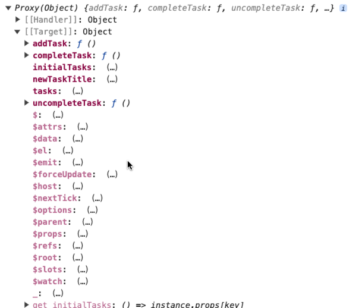
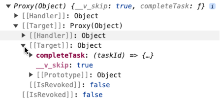
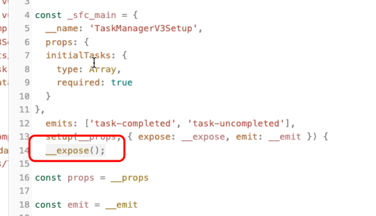
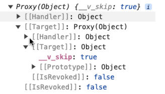

# setup 语法标签

setup 语法标签，是 Vue3 目前最推荐的写法。不过这种写法不是一开始就是这样的，是随着版本的升级一步一步演变而来的。

## Vue2 经典写法

Vue2 时期使用的是 Options API 语法，这是一种经典的写法。

哪怕现在是 Vue3 写法，Options API 语法依然可以使用，没有被废弃。

```js
<template>
  <div class="task-manager">
    <h2>任务列表</h2>
    <!-- 渲染各种待办事项 -->
    <ul>
      <li v-for="task in tasks" :key="task.id" :class="{ completed: task.completed }">
        <span>{{ task.title }}</span>
        <div class="buttons">
          <button v-if="!task.completed" @click="completeTask(task.id)">完成</button>
          <button v-else @click="uncompleteTask(task.id)">取消完成</button>
        </div>
      </li>
    </ul>
    <!-- 添加新任务 -->
    <form @submit.prevent="addTask">
      <input v-model="newTaskTitle" placeholder="添加新任务" />
      <button type="submit">添加任务</button>
    </form>
  </div>
</template>

<script>
export default {
  name: 'TaskManager',
  props: {
    initialTasks: {
      type: Array,
      required: true,
      default: () => []
    }
  },

  data() {
    return {
      tasks: [...this.initialTasks],
      newTaskTitle: '' // 新任务标题
    }
  },

  methods: {
    // 新增任务
    addTask() {
      if (this.newTaskTitle.trim() === '') {
        return
      }
      // 添加新任务
      this.tasks.push({
        id: Date.now(),
        title: this.newTaskTitle,
        completed: false
      })
      this.newTaskTitle = '' // 清空输入框
    },
    // 标记任务已完成
    completeTask(id) {
      const task = this.tasks.find((task) => task.id === id)
      if (task) {
        task.completed = true
        this.$emit('task-completed', task)
      }
    },
    // 标记任务未完成
    uncompleteTask(id) {
      const task = this.tasks.find((task) => task.id === id)
      if (task) {
        task.completed = false
        this.$emit('task-uncompleted', task)
      }
    }
  }
}
</script>
```

## Vue3 初期写法

Vue3 的时期，官方提出了 Composition API 语法，这是 Vue3 的初期写法，这种风格能够对组件的共有模块进行一个更好的组合复用。

Vue3 初期的时候写法和 Options API 大体上有很多相似的形式。

```js
<script>
import { ref, toRefs } from 'vue'

export default {
  name: 'TaskManager',

  props: {
    initialTasks: {
      type: Array,
      required: true,
      default: () => []
    }
  },

  emits: ['task-completed', 'task-uncompleted'],

  setup(props, { emit, expose }) {
    // setup 是一个生命周期方法
    // 在该方法中书写数据以及函数
    const { initialTasks } = toRefs(props)
    const tasks = ref([...initialTasks.value]) // 任务列表
    const newTaskTitle = ref('') // 存储新任务的标题

    // 添加任务
    const addTask = () => {
      if (newTaskTitle.value.trim() === '') {
        return
      }
      tasks.value.push({
        id: Date.now(),
        title: newTaskTitle.value,
        completed: false
      })
      newTaskTitle.value = ''
    }
    // 完成任务
    const completeTask = (taskId) => {
      const task = tasks.value.find((task) => task.id === taskId)
      if (task) {
        task.completed = true
        // 触发自定义事件
        emit('task-completed', task)
      }
    }
    // 取消完成任务
    const uncompleteTask = (taskId) => {
      const task = tasks.value.find((task) => task.id === taskId)
      if (task) {
        task.completed = false
        // 触发自定义事件
        emit('task-uncompleted', task)
      }
    }

    // 指定能够暴露的方法
    expose({
      completeTask
    })

    // 最后需要返回一个对象
    // 该对象里面就包含了需要在模板中使用的数据以及方法
    return {
      tasks,
      newTaskTitle,
      addTask,
      completeTask,
      uncompleteTask
    }
  }
}
</script>
```

可以看出早起的 Vue3 Composition API 写法实际上有 Options API 写法的影子，和 Vue2 语法有一定的相似性，同样都是导出一个对象。

最重要的特点是对象中多了一个 setup 函数，这是一个新的生命周期钩子方法。在该方法中，我们可以定义对应的数据和方法，并且在最后返回出去，在模版中可以使用所返回的数据和方法。

## defineComponent 写法

defineComponent 是 Vue3 引入的一个「辅助函数」，主要用于定义 Vue 组件，特别是使用 TS 时候可以提供更好的类型推断和校验。

通过使用 defineComponent，我们可以：

1、自动推断类型：减少显式类型注解，使代码更简洁。

2、减少冗余：不需要手动定义 Props 接口和响应式数据的类型。

3、提高可读性：使代码更易读、更易维护。

```js
<script>
import { defineComponent, toRefs, ref } from 'vue'

export default defineComponent({
  name: 'TaskManager',

  props: {
    initialTasks: {
      type: Array,
      required: true,
      default: () => []
    }
  },

  emits: ['task-completed', 'task-uncompleted'],

  setup(props, { emit }) {
    // setup是一个生命周期方法
    // 在该方法中书写数据以及函数
    const { initialTasks } = toRefs(props)
    const tasks = ref([...initialTasks.value]) // 任务列表
    const newTaskTitle = ref('') // 存储新任务的标题

    // 添加任务
    const addTask = () => {
      if (newTaskTitle.value.trim() === '') {
        return
      }
      tasks.value.push({
        id: Date.now(),
        title: newTaskTitle.value,
        completed: false
      })
      newTaskTitle.value = ''
    }
    // 完成任务
    const completeTask = (taskId) => {
      const task = tasks.value.find((task) => task.id === taskId)
      if (task) {
        task.completed = true
        // 触发自定义事件
        emit('task-completed', task)
      }
    }
    // 取消完成任务
    const uncompleteTask = (taskId) => {
      const task = tasks.value.find((task) => task.id === taskId)
      if (task) {
        task.completed = false
        // 触发自定义事件
        emit('task-uncompleted', task)
      }
    }

    // 最后需要返回一个对象
    // 该对象里面就包含了需要在模板中使用的数据以及方法
    return {
      tasks,
      newTaskTitle,
      addTask,
      completeTask,
      uncompleteTask
    }
  }
})
</script>
```

可以看出，defineComponent 仅仅只是一个辅助方法，和 TS 配合的好。但是没有从本质上改变初期 Composition API 的写法。

## setup 标签写法

从 Vue3.2 版本正式引入了 setup 语法糖，简化了 Composition API 的写法，使得组件定义更加的简洁和直观。

其优化的点主要如下：

1、简化书写：在传统的 setup 函数中，我们需要返回一个对象，其中包含需要在模板中使用的变量和方法。在 `<script setup>` 中，这一步被省略了，所有定义的变量和方法会自动暴露给模板使用，从而减少了样板代码。

2、更好的类型推断：在 `<script setup>` 中所有定义的内容都是顶层变量，TypeScript 的类型推断更加直观和简单。

```js
<script setup>
import { ref, toRefs } from 'vue'

const props = defineProps({
  initialTasks: {
    type: Array,
    required: true
  }
})

const emit = defineEmits(['task-completed', 'task-uncompleted'])

const { initialTasks } = toRefs(props)
const tasks = ref([...initialTasks.value]) // 任务列表
const newTaskTitle = ref('') // 存储新任务的标题

// 添加任务
const addTask = () => {
  if (newTaskTitle.value.trim() === '') {
    return
  }
  tasks.value.push({
    id: Date.now(),
    title: newTaskTitle.value,
    completed: false
  })
  newTaskTitle.value = ''
}

// 完成任务
const completeTask = (taskId) => {
  const task = tasks.value.find((task) => task.id === taskId)
  if (task) {
    task.completed = true
    // 触发自定义事件
    emit('task-completed', task)
  }
}

// 取消完成任务
const uncompleteTask = (taskId) => {
  const task = tasks.value.find((task) => task.id === taskId)
  if (task) {
    task.completed = false
    // 触发自定义事件
    emit('task-uncompleted', task)
  }
}

defineExpose({
  // 要暴露的成员
  completeTask
})
</script>
```

在 setup 语法糖中，没有了模版语法，定义数据和方法都能够直接在模版中使用。

另外通过 defineProps 获取到父组件传递过来的 props，通过 defineEmits 来触发父组件的事件。

究竟什么是宏呢？

宏这个概念最初是在 C 语言里面引入的，大家知道，C 语言是编译型语言，在开始编译之前，**会对宏代码进行一个文本替换的操作**，这就被称之为预处理。

举个例子，在 C 语言中通过 #define 来定义宏：

```c
// 定义了两个宏
#define PI 3.14159
#define SQUARE(x) ((x) * (x))

int main() {
    double area = PI * SQUARE(5);
    return 0;
}
```

在编译开始之前，会将 PI 替换为 3.14159，将 SQUARE(5) 替换为 ((5) \* (5))。

理解了这个，回头再看 defineProps 以及 defineEmits，你就非常好理解了，这两个部分的代码回头会被替换掉，替换成 Vue3 刚出来时的写法。

defineProps 和 defineEmits 将会替换成如下的内容：

```js
export default {
  // ...
  props: {
    initialTasks: {
      type: Array,
      required: true,
      default: () => []
    }
  },
  emits: ['task-completed', 'task-uncompleted']
  // ...
};
```

这一点可以从 vite-plugin-inspect 插件的编译分析中得到验证。

从插件的编译分析中可以看出，setup 标签语法其实就是一个语法糖，方便开发者书写。

在编译的时候最终会被编译为 Comoposition API 的早期写法。

## expose 上的区别

setup 虽然说是一种语法糖，不过在某些行为上的表现还是和原始的 Composition API 有一些区别的，例如 expose。

解释一下 expose：

> 一般来讲，父组件管理父组件的数据和方法，子组件管理子组件的数据和方法，如果涉及到通信，那么通过 props 的方式来进行传递。但如果一个组件通过 ref 获取到组件实例，在早期的 Composition API 中，能够拿到组件内部所有数据和方法的。

引用 Options API 组件：

```js
const taskCom1 = ref(null);

onMounted(() => {
  console.log(taskCom1.value);
});
```



这种方式是很危险的，因为正常来讲父子组件是通过 props 和 emit 来进行交互的。有个好处就是传什么就使用什么，而不是拿到组件示例所有的数据都获取到了。

Vue 提供了一个名为 expose 的方法，由组件自己来决定，如果外部拿到我这个组件实例，我能暴露哪些成员给对方。

在 Setup 语法中，默认行为和 Options API 是一致的。

使用 expose 指定能够暴露出去的数据：

```js
// 指定能够暴露的方法
expose({
  completeTask
});
```



而到了 setup 标签写法中，则默认行为就是不向外部暴露任何的成员。

如果想要暴露某个成员，仍然是通过 expose 的方式，这里会涉及到一个 defineExpose 的宏。



```js
defineExpose({
  // 要暴露的成员
});
```




