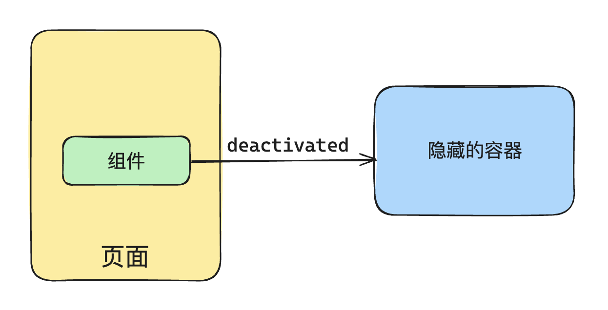
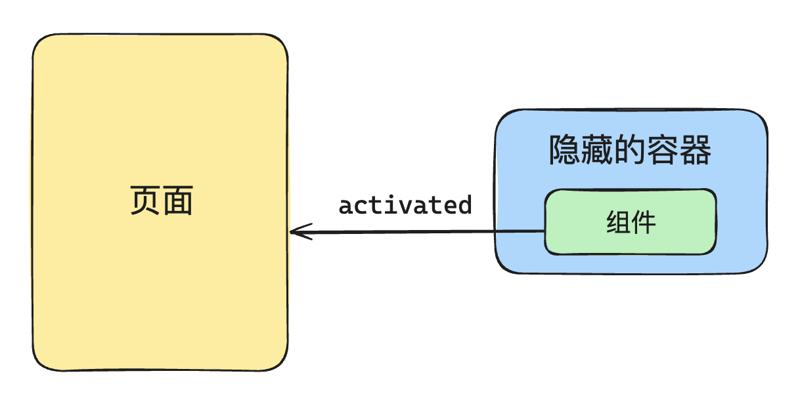
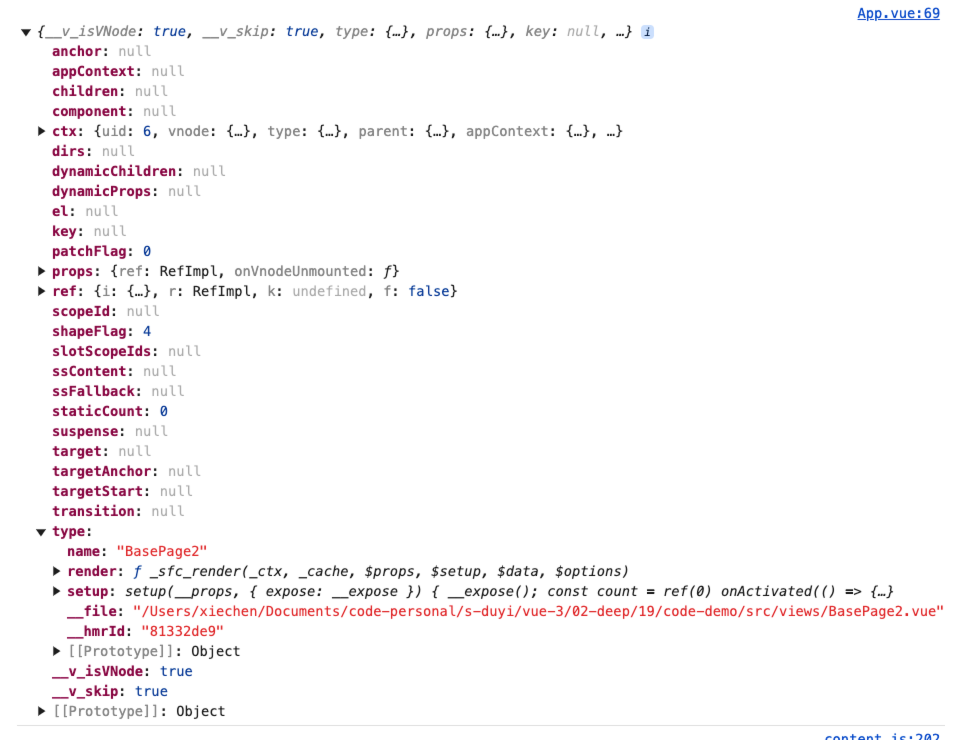

# keep-alive 生命周期

keep-alive 是 Vue 的内置组件，它用于缓存组件实例，避免组件被频繁销毁/重建，从而提高性能。

## keep-alive 基本实现

keep-alive 组件的实现需要「渲染器层面的支持」。keep-alive 内的组件需要卸载的时候不能真的卸载，否则无法维护组件当前的状态了。

因此正确的做法是：将需要 keep-alive 的组件搬运到一个「隐藏的容器里面」，从而实现“假卸载”。



keep-alive 内的组件需要挂载的时候，也是直接从隐藏的容器里面再次搬运到原来的容器。



一个最基本的 keep-alive 组件，实现起来并不复杂，代码如下：

```js
const KeepAlive = {
  // 这是 keepalive 组件独有的属性，用于标识这是一个 keepalive 组件
  __isKeepAlive: true,
  setup(props, { slots }) {
    // 这是一个缓存对象
    // key：vnode.type
    // value: vnode
    const cache = new Map()
    // 存储当前 keepalive 组件的实例
    const instance = currentInstance;
    // 这里从组件实例上面解构出来两个方法，这两个方法实际上是由渲染器注入的
    const { move, createElement } = instance.keepAliveCtx;
    
    // 创建隐藏容器
    const storageContainer = createElement("div");
    
    // 这两个方法所做的事情，就是将组件从页面和隐藏容器之间进行移动
    // 这两个方法在渲染器中会被调用
    instance._deActivate = (vnode) => {
      move(vnode, storageContainer);
    };
    instance._activate = (vnode, container, anchor) => {
      move(vnode, container, anchor);
    };

    
    return () => {
      // 获取到默认插槽里面的内容
      let rawVNode = slots.default();
      
      // 如果不是对象，说明是非组件的虚拟节点，直接返回
      if (typeof rawVNode.type !== "object") {
        return rawVNode;
      }
      
      // 接下来我们从缓存里面找一下，看当前的组件是否存在于缓存里面
      const cachedVNode = cache.get(rawVNode.type);
      
      if (cachedVNode) {
        // 缓存中存在
        // 如果缓存中存在，直接使用缓存的组件实例
        rawVNode.component = cachedVNode.component;
        // 并且挂上一个 keptAlive 属性
        rawVNode.keptAlive = true;
      } else {
        // 缓存中不存在
        // 那么就添加到缓存里面，方便下次使用
        cache.set(rawVNode.type, rawVNode);
      }
      // 接下来又挂了一个 shouldKeepAlive 属性
      rawVNode.shouldKeepAlive = true;
      // 将 keepalive 组件实例也添加到 vnode 上面，后面在渲染器中有用
      rawVNode.keepAliveInstance = instance;
      return rawVNode;
    };
  },
};
```



**keep-alive 和渲染器是结合得比较深的**，keep-alive 组件本身并不会渲染额外的什么内容，它的渲染函数最终只返回需要被 keep-alive 的组件，这样的组件我们可以称之为“内部组件”。

keep-alive 组件会对这些组件添加一些标记属性，以便渲染器能够根据这些标记属性执行一些特定的逻辑：

- keptAlive：表示内部组件已经被缓存了，这样当内部组件需要重新渲染的时候，渲染器并不会重新挂载它，而是将其激活。

```js
// 渲染器内部代码片段
function patch(n1, n2, container, anchor) {
  if (n1 && n1.type !== n2.type) {
    unmount(n1);
    n1 = null;
  }

  const { type } = n2;

  if (typeof type === "string") {
    // 省略部分代码
  } else if (type === Text) {
    // 省略部分代码
  } else if (type === Fragment) {
    // 省略部分代码
  } else if (typeof type === "object" || typeof type === "function") {
    // component
    if (!n1) {
      // 如果该组件已经被 KeepAlive，则不会重新挂载它，而是会调用_activate 来激活它
      if (n2.keptAlive) {
        n2.keepAliveInstance._activate(n2, container, anchor);
      } else {
        mountComponent(n2, container, anchor);
      }
    } else {
      patchComponent(n1, n2, anchor);
    }
    
  }
}
```

- shouldKeepAlive：该属性会被添加到 vnode 上面，这样当渲染器卸载内部组件的时候，不会真正的去卸载，而是将其移动到隐藏的容器里面

```js
// 渲染器代码片段
function unmount(vnode) {
  if (vnode.type === Fragment) {
    vnode.children.forEach((c) => unmount(c));
    return;
  } else if (typeof vnode.type === "object") {
    // vnode.shouldKeepAlive 是一个布尔值，用来标识该组件是否应该 KeepAlive
    if (vnode.shouldKeepAlive) {
      // 对于需要被 KeepAlive 的组件，我们不应该真的卸载它，而应调该组件的父组件，
      // 即 KeepAlive 组件的 _deActivate 函数使其失活
      vnode.keepAliveInstance._deActivate(vnode);
    } else {
      unmount(vnode.component.subTree);
    }
    return;
  }
  const parent = vnode.el.parentNode;
  if (parent) {
    parent.removeChild(vnode.el);
  }
}
```

- keepAliveInstance：该属性让内部组件持有了 KeepAlive 的组件实例，回头在渲染器中的某些场景下可以通过该属性来访问 KeepAlive 组件实例上面的 _deActivate 以及 _activate。

## include 和 exclude

见文档

## 缓存管理

见文档

## 总结

- keep-alive 核心原理就是将内部组件搬运到隐藏容器，以及从隐藏容器搬运回来。因为没有涉及到真正的卸载，所以组件状态也得以保留。

- keep-alive 和渲染器是结合得比较深的，keep-alive 会给内部组件添加一些特殊的标识，这些标识就是给渲染器的用，回头渲染器在挂载和卸载组件的时候，会根据这些标识执行特定的操作。

- include 和 exclude 核心原理就是对内部组件进行一个匹配操作，匹配上了再进入后面的缓存逻辑

- max：添加之前看一下缓存里面有没有缓存过该组件
    
    - 缓存过：更新到队列最后

    - 没有缓存过：加入到缓存里面，但是要看一下有没有超过最大值，超过了就需要进行修剪。