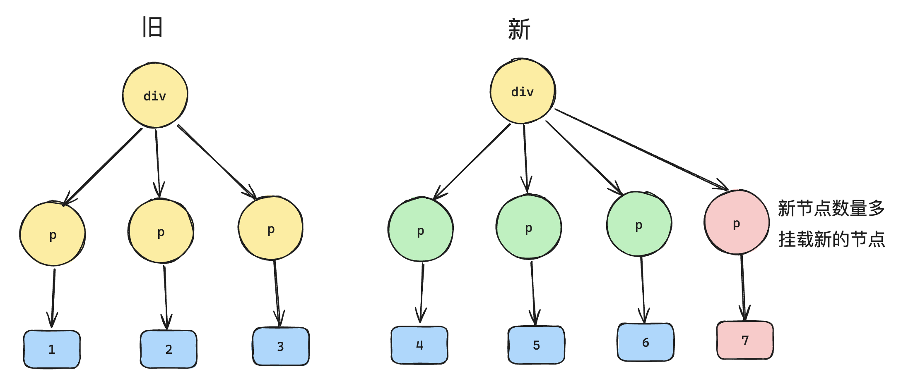
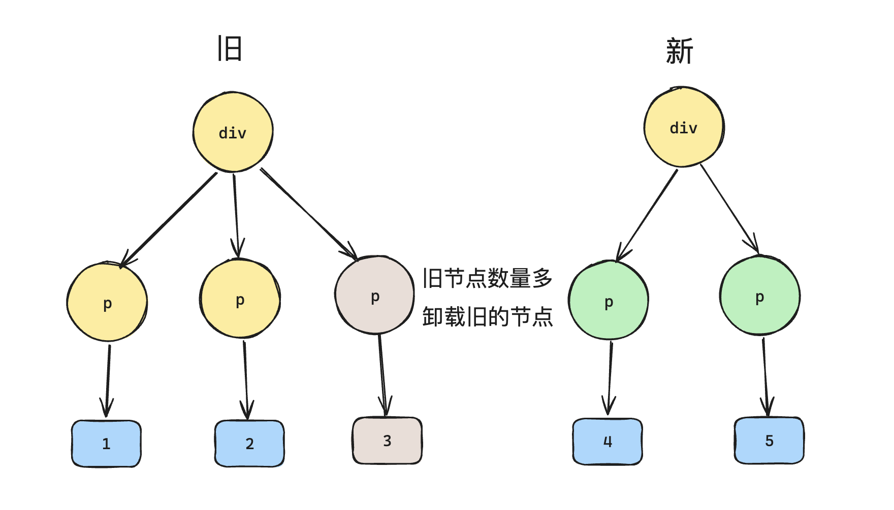
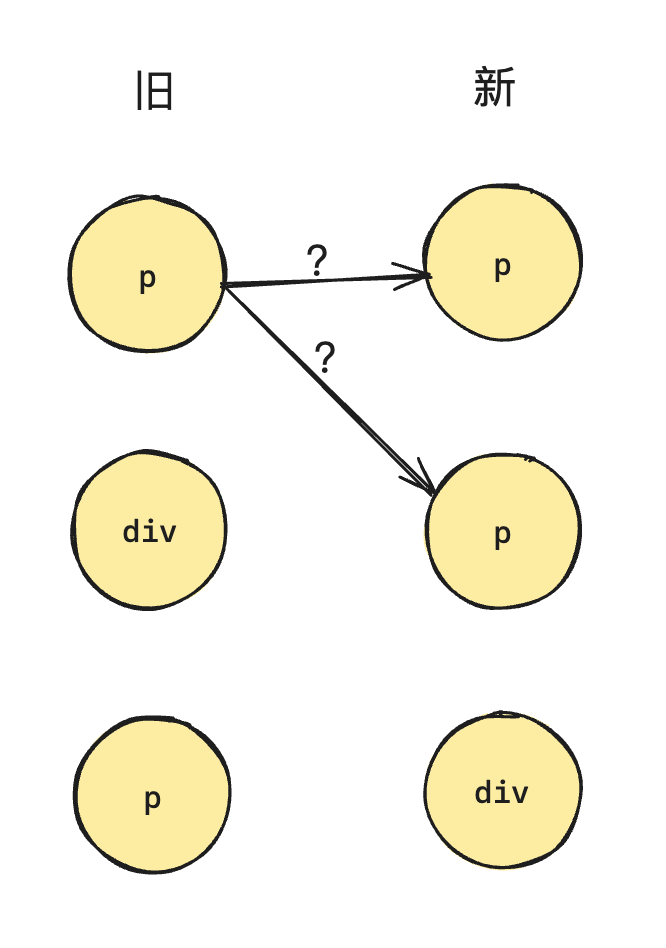
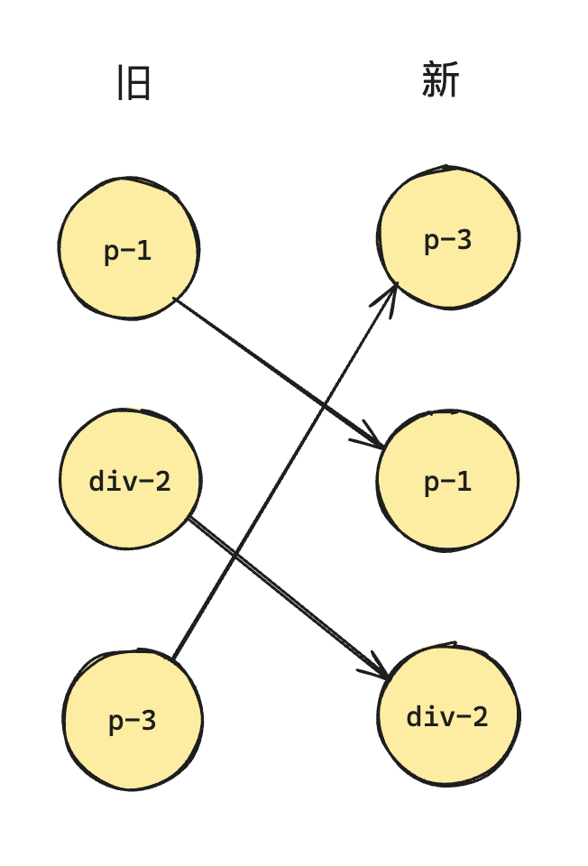
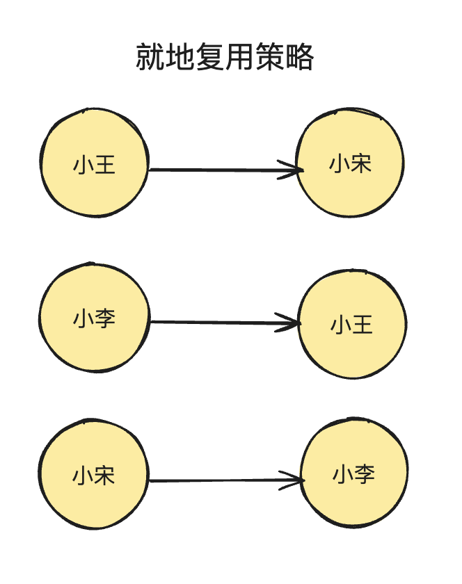
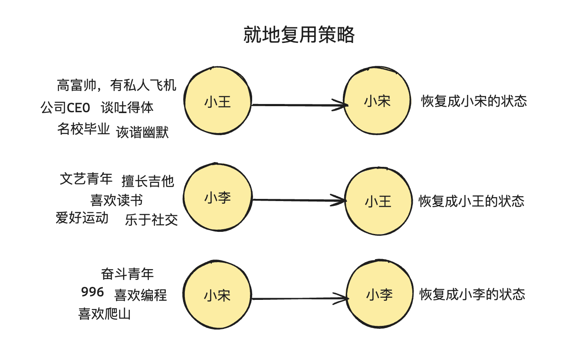
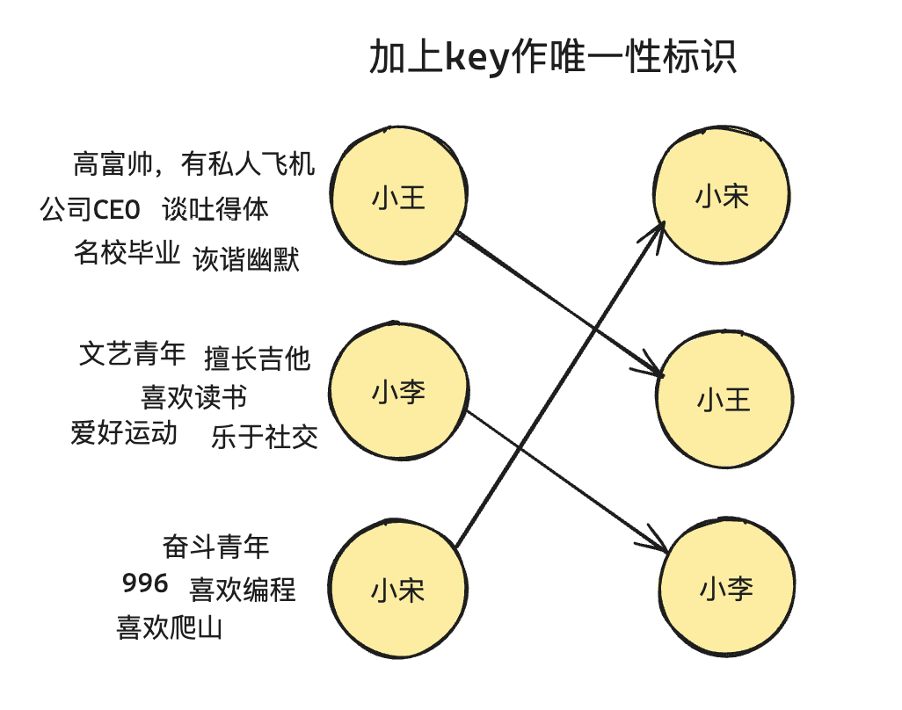

# key 的本质

primary key （主键）用于标记数据的唯一性。

为了方便精准的查找，因为是独一无二的。

Vue 中的 key 也是用来做唯一标识的，给虚拟 DOM 节点添加唯一的标识。

为什么需要做这个唯一标识？

## 不采用复用策略

```js
const oldVNode = {
  type: 'div',
  children: [
    {type: 'p', children: '1'},
    {type: 'p', children: '2'},
    {type: 'p', children: '3'},
  ]
}
```

```html
<div>
  <p>1</p>
  <p>2</p>
  <p>3</p>
</div>
```

更新后的虚拟 DOM 为：

```js
const newVNode = {
  type: 'div',
  children: [
    {type: 'p', children: '4'},
    {type: 'p', children: '5'},
    {type: 'p', children: '6'},
  ]
}
```

如果不采用，需要执行 6 次 DOM 操作：

- 卸载所有旧的子节点，需要 3 次 DOM 删除操作

- 挂载所有新的子节点，需要 3 次 DOM 创建操作

实际上仅仅是 P 元素的文本节点的变化，P 元素没有任何的变化。最理想的是服用 P 元素并且对子节点的内容进行更新。

这样操作只操作 3 次 DOM 即可。

## 采用复用策略

1、先考虑更新前后长度、类型不变的情况。

这里可以写出如下的伪代码：

```js
function patchChildren(n1, n2, container){
  if(typeof n2.children === 'string'){
    // 说明该节点的子节点就是文本节点
    // ...
  } else if(Array.isArray(n2.children)){
    // 说明该节点的子节点也是数组
    const oldChildren = n1.children; // 旧的子节点数组
    const newChildren = n2. children; // 新的子节点数组
    
    // 目前假设长度没有变化
    for(let i = 0; i < oldChildren.length; i++){
      // 对文本子节点进行更新
      patch(oldChildren[i], newChildren[i])
    }
  } else {
    // 其他情况
    // ...
  }
}
```

2、考虑长度发生变化的情况

- 新节点更多的情况，需要挂在新节点



- 新节点更少的情况，需要卸载多余节点



因此伪代码会发生一些变化。

```js
function patchChildren(n1, n2, container){
  if(typeof n2.children === 'string'){
    // 说明该节点的子节点就是文本节点
    // ...
  } else if(Array.isArray(n2.children)){
    // 说明该节点的子节点也是数组
    const oldChildren = n1.children; // 旧的子节点数组
    const newChildren = n2. children; // 新的子节点数组
    
    // 存储一下新旧节点的长度
    const oldLen = oldChildren.length; // 旧子节点数组长度
    const newLen = newChildren.length; // 新子节点数组长度
    
    // 接下来先找这一组长度的公共值，也就是最小值
    const commonLength = Math.min(oldLen, newLen);
    
    // 先遍历最小值，把该处理的节点先更新
    for(let i = 0; i < commonLength; i++){
      // 对文本子节点进行更新
      patch(oldChildren[i], newChildren[i])
    }
    
    // 然后接下来处理长度不同的情况
    if(newLen > oldLen){
      // 新节点多，那么就做新节点的挂载
      for(let i = commonLength; i < newLen; i++){
        patch(null, newChildren[i], container);
      } 
    } else if(oldLen > newLen){
      // 旧节点多，做旧节点的卸载
      for(let i = commonLength; i < oldLen; i++){
        unmount(oldChildren[i]);
      }
    }
  } else {
    // 其他情况
    // ...
  }
}
```

3、考虑类型的变化

```js
const oldVNode = {
  type: 'div',
  children: [
    {type: 'p', children: '1'},
    {type: 'div', children: '2'},
    {type: 'span', children: '3'},
  ]
}

const newVNode = {
  type: 'div',
  children: [
    {type: 'span', children: '3'},
    {type: 'p', children: '1'},
    {type: 'div', children: '2'},
  ]
}
```

按照上面目前的设计，这种情况的时候统统无法进行复用，又回到了最初的问题，需要 6 次 DOM 的操作。

但是我们稍作观察，会发现上面的例子中仅仅是元素标签移动了位置，因此最理想的情况是移动 DOM 即可，这样也能达到对 DOM 节点的复用。

涉及到一个问题：如何确定是同一个类型，能够复用的节点。

如果仅仅只是判断 vnode 的 type 是否相同，这种方式并不可靠。

```js
const oldVNode = {
  type: 'div',
  children: [
    {type: 'p', children: '3'},
    {type: 'div', children: '2'},
    {type: 'p', children: '1'},
  ]
}

const newVNode = {
  type: 'div',
  children: [
    {type: 'p', children: '1'},
    {type: 'p', children: '3'},
    {type: 'div', children: '2'},
  ]
}
```

这种情况下，没有办法很好的有一个对应关系，因为有多种相同类型的节点。



（箭头画反了）

## 加入 key 标识

key 相当于给每一个 vnode 一个身份证号，通过 key 可以找到唯一的 vnode，而非多个。

```js
const oldVNode = {
  type: 'div',
  children: [
    {type: 'p', children: '3', key: 1},
    {type: 'div', children: '2', key: 2},
    {type: 'p', children: '1', key: 3},
  ]
}

const newVNode = {
  type: 'div',
  children: [
    {type: 'p', children: '1', key: 3},
    {type: 'p', children: '3', key: 1},
    {type: 'div', children: '2', key: 2},
  ]
}
```



因此实际的判断中，如果 vnode 的 tppe 属性和 key 属性都一样，说明是同一组因映射，并且新旧节点中都出现了就可以进行 DOM 节点的复用。

> 为什么标记唯一性？方便查找。为什么要进行查找？方便后面对比的时候更好的复用。

哪怕没有 key，我在旧节点中找到一个类型相同的，就复用该 DOM 节点，这样的设计不行么？

实际上，在没有 key 的情况下，Vue 内部采用的就是这样的复用策略，这种策略在 Vue 中被称之为“就地更新”策略。这种策略默认是高效的，但是这种复用策略仅仅是保证 DOM 节点的类型对上了，如果节点本身还依赖子组件状态或者临时 DOM 状态，由于这种复用策略没有精准的对上号，因此会涉及到子组件状态或者临时 DOM 状态的还原。

举个例子，假设旧节点是三个男生，新节点也是三个男生：



如果不考虑其他的因素，只考虑是否是男生，然后简单的把名字变一下，那么这种就地复用的策略是非常高效。

但是很多时候依赖子组件状态或者临时的 DOM 状态：



在这种情况下，就地复用的策略反而是低效的，因为涉及到子组件状态或者临时的 DOM 状态的恢复。

因此在这个时候，最好的方式就是加上 key，让新旧节点能够精准的对应上。



还有一点需要注意，那就是 避免使用下标来作为 key 值。使用下标作为 key 值时，如果列表中的元素顺序发生变化，Vue 会复用错误的元素，导致不必要的 DOM 更新和渲染错误。

例如，当你在列表中插入或删除元素时，使用下标会使得每个元素的 key 发生变化，导致 Vue 不能正确识别元素，从而导致状态和数据的不一致。

```js
// 初始状态
[{ id: 1, text: 'Item 1' }, { id: 2, text: 'Item 2' }, { id: 3, text: 'Item 3' }]

// 删除第二个元素后的状态
[{ id: 1, text: 'Item 1' }, { id: 3, text: 'Item 3' }]
```

在这种情况下，如果使用下标作为 key 值，当删除第二个元素后，第三个元素的下标会从 2 变为 1，这会使 Vue 误以为原本的第三个元素和第二个元素是同一个，从而导致错误的更新。

## 总结

key 本质上就是给 VNode 节点做唯一性标识，算是 VNode 的一个身份证号。

特别是在渲染列表时。key 的作用主要有以下几点：

- 高效的更新： key 帮助 Vue 识别哪些元素是变化的、哪些是新的、哪些是需要被移除的。

    - 在没有 key 的情况下，Vue 会尽量复用已有元素，而不管它们的实际内容是否发生了变化，这可能导致不必要的更新或者错误的更新。

    - 通过使用 key，Vue 可以准确地知道哪些元素发生了变化，从而高效地更新 DOM。

- 确保元素的唯一性： key 属性需要是唯一的，这样每个元素在列表中都可以被唯一标识。这避免了在元素移动、插入或删除时出现混淆，确保 Vue 可以正确地追踪每个元素。

- 提升渲染性能： 使用 key 可以显著提升列表渲染的性能。因为 Vue 能通过 key 快速定位到需要更新的元素，而不是重新渲染整个列表。尤其在处理大型列表时，使用 key 可以避免大量不必要的 DOM 操作，提升应用的响应速度。