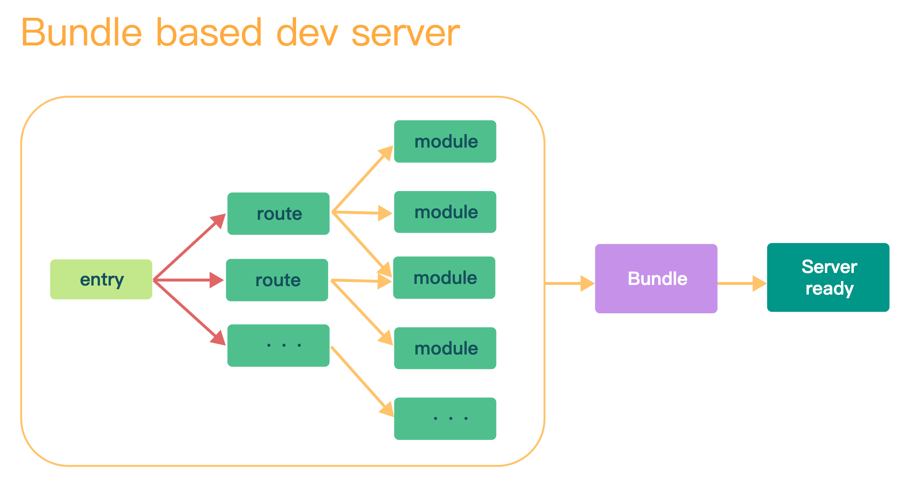
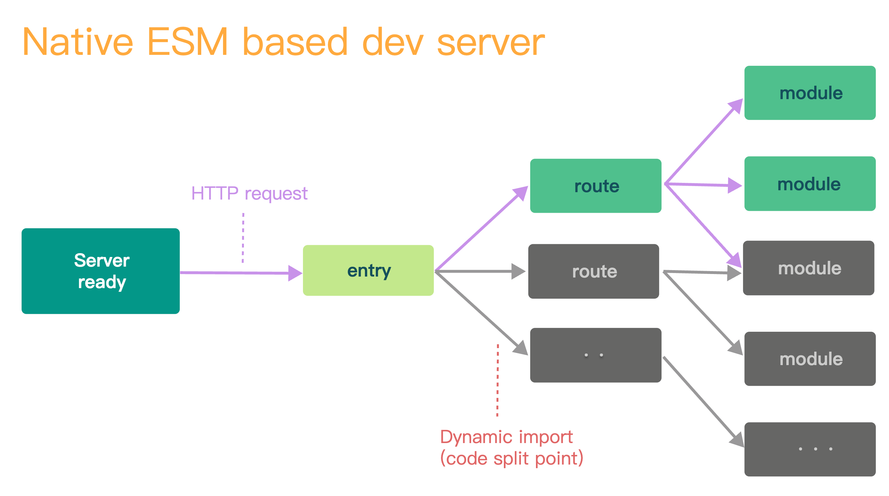
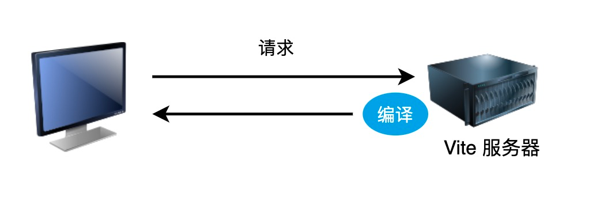

# vite的认识

Vite 是什么？

脚手架？构建工具？

脚手架和构建工具的定义：

- 脚手架：帮助我们搭建项目开发环境，提供项目的基本结构和基本配置；

- 构建工具：将从开发环境代码编译为生产环境的代码；

 

构建工具的发展：

- 第一代：以 npm script 为核心，grunt、gulp 为代表的构建工具。主要是对文件的编译、合并、压缩、等工作；

- 第二代：以 browserify 为核心，webpack、rollup 为代表的构建工具。加强了对模块的处理，对模块的依赖关系进行处理，对模块进行合并打包；

- 第三代：往“绣化”的方向发展（使用 Rust 将前端工具链全部重写一遍）；

    - Babel => swc

    - PostCss => lightingCss

    - Electron => Tauri

    - ESLint => dprint

    - Webpack => Turbopack

    - rollup => rolldown

 

脚手架的发展：

本身是帮助开发者搭建开发环境项目的工具，但是现代脚手架往往会内置构建工具。

- VueCli：内置了 Webpack 作为构建工具；

- CreateReactApp：内置了 Webpack 作为构建工具；

现在脚手架工具和构建工具的界限越来越模糊了，可以认为构建工具是脚手架工具内部的一部分。

Vite 也是相同的情况，可以搭建各种各样（Vue、React、Sevite、Solid 等）的项目，也内置了构建工具进行打包。

Vite 包含了两个构建工具：

- esbuild：开发环境；

- rollup：生产环境；

## Vite 的核心原理

初衷是为了提升开发体验。

Webpack 的痛点：

- 构建大型项目的时候非常的慢，因为在启动的时候会想对项目进行打包，然后运行打包后的文件；

    - 

- 配置比较复杂；

Vite 是如何解决的：

- 完全跳过打包过程，利用浏览器的 import 机制，按需获取内容；

    - 

- 浏览器针对 .vue 这样的模块文件，需要进行编译（Vite 会劫持浏览器的请求，编译为浏览器可以运行的内容再返回给浏览器）；

    - 

- 热更新的实现底层实际上使用的是 Websocket 实现的；